# Atomic Swap Protocol using Adapter Signatures

## Overview

This document describes the adapter signature-based atomic swap protocol implemented in this tutorial. The protocol enables trustless, atomic exchange of digital assets across two independent blockchains without requiring hash-timelocked contracts (HTLCs) or on-chain scripting.

### Notation

This document uses **Unicode mathematical notation** throughout for maximum compatibility:

- **Subscripts**: sk₀ᴬ, sk₁ᴮ (instead of sk_0^A, sk_1^B)
- **Superscripts**: pkᴬ, Txᴮ (instead of pk_A, Tx_B)
- **Tildes**: σ̃ᴬ, sig̃ᴮ for pre-signatures
- **Greek letters**: π (pi), σ (sigma), directly as Unicode
- **Mathematical symbols**: ∈ (element of), ℤ (integers), · (dot product), ‖ (concatenation)

This approach ensures the notation renders correctly in all contexts (GitHub, Mermaid diagrams, documentation tools) without requiring LaTeX/MathJax support.

## Protocol Flow Diagram

```mermaid
%%{init: {'theme':'dark', 'themeVariables': {'fontSize':'24px'}}}%%
sequenceDiagram
    autonumber

    box Swap Parties
        participant Alice
        participant Bob
    end

    box Blockchains
        participant ChainA as Blockchain A
        participant ChainB as Blockchain B
    end

    Note over Alice,ChainB: Phase 1: Setup and Key Exchange

    par Key Generation
        Alice->>+Alice: Generate keypair<br/>(sk₀ᴬ, sk₁ᴬ, pkᴬ)
        Alice->>-Alice: Ready
    and
        Bob->>+Bob: Generate keypair<br/>(sk₀ᴮ, sk₁ᴮ, pkᴮ)
        Bob->>-Bob: Ready
    end

    Alice->>Bob: Send pkᴬ
    Bob->>Alice: Send pkᴮ

    Note over Alice,Bob: Agree on swap terms:<br/>Alice: 10 ChainA tokens<br/>Bob: 5 ChainB tokens

    Alice->>+Alice: Generate adapter secret y ∈ ℤ*_q
    Alice->>Alice: Compute adapter point Y = y·B
    Alice->>-Alice: Generate NIZK proof π = Prove_zk(Y, y)

    Alice->>Bob: Send (Y, π)

    Bob->>+Bob: Verify NIZK proof
    Bob->>-Bob: Verify_zk(Y, π) = 1 ✓

    Note over Alice,ChainB: Phase 2: Adapted Pre-Signature Creation

    Alice->>+ChainA: Query UTXO
    ChainA-->>-Alice: UTXO confirmed (10 tokens)

    Alice->>+Alice: Build Txᴬ sending 10 tokens to pkᴮ
    Alice->>Alice: Create adapted pre-signature σ̃ᴬ:<br/>• rᴬ = H₂(sk₁ᴬ ‖ Txᴬ ‖ kᴬ)<br/>• R_signᴬ = rᴬ·B + Y<br/>• sig̃ᴬ = rᴬ + hᴬ·sk₀ᴬ
    Alice->>-Alice: Pre-signature ready

    Alice->>Bob: Send (Txᴬ, σ̃ᴬ)

    critical Bob verifies Alice's pre-signature
        Bob->>+Bob: Compute R'ᴬ = R_signᴬ - Y
        Bob->>Bob: Compute hᴬ = H₂(R_signᴬ ‖ pkᴬ ‖ Txᴬ)
        Bob->>-Bob: Verify: sig̃ᴬ·B = R'ᴬ + hᴬ·pkᴬ ✓
    option Verification fails
        Bob->>Alice: Abort protocol
    end

    Bob->>+ChainB: Query UTXO
    ChainB-->>-Bob: UTXO confirmed (5 tokens)

    Bob->>+Bob: Build Txᴮ sending 5 tokens to pkᴬ
    Bob->>Bob: Create adapted pre-signature σ̃ᴮ:<br/>• rᴮ = H₂(sk₁ᴮ ‖ Txᴮ ‖ kᴮ)<br/>• R_signᴮ = rᴮ·B + Y (same Y!)<br/>• sig̃ᴮ = rᴮ + hᴮ·sk₀ᴮ
    Bob->>-Bob: Pre-signature ready

    Bob->>Alice: Send (Txᴮ, σ̃ᴮ)

    Note over Alice,ChainB: Phase 3: Pre-Signature Verification

    critical Alice verifies Bob's pre-signature
        Alice->>+Alice: Compute R'ᴮ = R_signᴮ - Y
        Alice->>Alice: Compute hᴮ = H₂(R_signᴮ ‖ pkᴮ ‖ Txᴮ)
        Alice->>-Alice: Verify: sig̃ᴮ·B = R'ᴮ + hᴮ·pkᴮ ✓
    option Verification fails
        Alice->>Bob: Abort protocol
    end

    Note over Alice,Bob: ✓ Both parties have verified adapted pre-signatures<br/>⚠ Neither can execute yet (both need y)

    Note over Alice,ChainB: Phase 4: Atomic Execution

    Alice->>+Alice: Complete signature: sigᴬ = sig̃ᴬ + y
    Alice->>-ChainA: Publish Txᴬ with σᴬ = (R_signᴬ, sigᴬ)

    activate ChainA
    ChainA->>ChainA: Verify: sigᴬ·B = R_signᴬ + hᴬ·pkᴬ ✓
    ChainA-->>Alice: ✓ Transaction confirmed<br/>Alice receives 5 tokens
    deactivate ChainA

    Bob->>ChainA: Observe Txᴬ published

    critical Bob extracts adapter secret
        Bob->>+Bob: Extract: y = sigᴬ - sig̃ᴬ
        Bob->>-Bob: Verify: Y = y·B ✓
    end

    Bob->>+Bob: Complete signature: sigᴮ = sig̃ᴮ + y
    Bob->>-ChainB: Publish Txᴮ with σᴮ = (R_signᴮ, sigᴮ)

    activate ChainB
    ChainB->>ChainB: Verify: sigᴮ·B = R_signᴮ + hᴮ·pkᴮ ✓
    ChainB-->>Bob: ✓ Transaction confirmed<br/>Bob receives 10 tokens
    deactivate ChainB

    Note over Alice,ChainB: 🎉 Swap Complete!<br/>Both parties have exchanged assets atomically
```



## Cryptographic Foundation

### Choice of Signature Scheme

Based on comprehensive research (see `research/2025-11-14-ed25519-adapter-signatures.md` and `research/2025-11-14-two-party-atomic-swap-protocol.md`), this implementation uses:

**Primary**: Randomized EdDSA (rEdDSA) adapter signatures on Ed25519
**Rationale**:

- Complete specification from Zhu et al. (2024) with formal security proofs
- Direct Cardano/Monero compatibility
- Better performance than ECDSA alternatives (33% smaller signatures)
- Clean mathematical structure ideal for education

**Reference**: "Adaptor signature based on randomized EdDSA in blockchain" (Zhu et al., Digital Communications and Networks, 2024)

### Adapter Signature Concept

An adapter signature is a pre-signature that:

1. Can be verified as "almost valid"
2. Requires a secret value y to complete
3. Reveals y when completed and published

**Key Property**: If Alice can complete her signature only by learning the adapter secret y, and publishing her transaction reveals y, then Bob can extract y and atomically complete his transaction.

## Protocol Phases (V1 - Simplified)

**Note**: This is the simplified version for v1 focusing on adapter signature mechanics. Future versions will add multisig locking and refund timelocks (see IMPLEMENTATION-PLAN.md).

### Phase 1: Setup and Key Exchange

```
1. Alice generates rEdDSA keypair:
   - Private: (sk₀ᴬ, sk₁ᴬ)
   - Public: pkᴬ = sk₀ᴬ · B

2. Bob generates rEdDSA keypair:
   - Private: (sk₀ᴮ, sk₁ᴮ)
   - Public: pkᴮ = sk₀ᴮ · B

3. Alice and Bob exchange public keys via TMVar

4. Swap terms (hardcoded for v1):
   - Alice offers: 10 ChainA tokens
   - Bob offers: 5 ChainB tokens

5. Alice generates adapter secret: y ∈ ℤ*_q (random scalar)

6. Alice computes adapter point: Y = y · B

7. Alice generates NIZK proof: π = Prove_zk(Y, y)
   Proves: "I know y such that Y = y·B"

8. Alice sends (Y, π) to Bob via TMVar

9. Bob verifies NIZK proof: Verify_zk(Y, π) = 1
```

### Phase 2: Adapted Pre-Signature Creation

**Alice creates adapted pre-signature** (following Zhu et al. 2024):

```
10. Alice queries her UTXO on ChainA (has 10 tokens)

11. Alice builds transaction Txᴬ:
    Inputs:  Alice's UTXO (10 tokens)
    Outputs: 10 tokens to Bob's public key pkᴮ

12. Alice creates adapted pre-signature for Txᴬ:
    a. Select random kᴬ ∈ ℤ*_q
    b. Compute rᴬ = H₂(sk₁ᴬ ‖ Txᴬ ‖ kᴬ) mod q
    c. Compute R_preᴬ = rᴬ · B
    d. Compute adapted nonce: R_signᴬ = R_preᴬ + Y  ← KEY: Add adapter point!
    e. Compute challenge: hᴬ = H₂(R_signᴬ ‖ pkᴬ ‖ Txᴬ)
    f. Compute pre-signature scalar: sig̃ᴬ = rᴬ + hᴬ · sk₀ᴬ mod q
       Note: Does NOT include y!
    g. Output: σ̃ᴬ = (sig̃ᴬ, R_signᴬ, π)

13. Alice sends (Txᴬ, σ̃ᴬ) to Bob via TMVar
```

**Bob creates adapted pre-signature**:

```
14. Bob receives and verifies Alice's adapted pre-signature:
    a. Parse σ̃ᴬ = (sig̃ᴬ, R_signᴬ, π)
    b. Compute R'ᴬ = R_signᴬ - Y  ← Remove adapter point
    c. Compute hᴬ = H₂(R_signᴬ ‖ pkᴬ ‖ Txᴬ)
    d. Verify: sig̃ᴬ · B = R'ᴬ + hᴬ · pkᴬ
    e. Verify: Verify_zk(Y, π) = 1
    f. If valid, continue; else abort

15. Bob queries his UTXO on ChainB (has 5 tokens)

16. Bob builds transaction Txᴮ:
    Inputs:  Bob's UTXO (5 tokens)
    Outputs: 5 tokens to Alice's public key pkᴬ

17. Bob creates adapted pre-signature for Txᴮ using Alice's Y:
    a. Select random kᴮ ∈ ℤ*_q
    b. Compute rᴮ = H₂(sk₁ᴮ ‖ Txᴮ ‖ kᴮ) mod q
    c. Compute R_preᴮ = rᴮ · B
    d. Compute adapted nonce: R_signᴮ = R_preᴮ + Y  ← Same Y from Alice!
    e. Compute challenge: hᴮ = H₂(R_signᴮ ‖ pkᴮ ‖ Txᴮ)
    f. Compute pre-signature scalar: sig̃ᴮ = rᴮ + hᴮ · sk₀ᴮ mod q
    g. Output: σ̃ᴮ = (sig̃ᴮ, R_signᴮ, π)

18. Bob sends (Txᴮ, σ̃ᴮ) to Alice via TMVar
```

### Phase 3: Pre-Signature Verification

```
19. Alice receives (Txᴮ, σ̃ᴮ) from Bob

20. Alice verifies Bob's adapted pre-signature:
    a. Parse σ̃ᴮ = (sig̃ᴮ, R_signᴮ, π)
    b. Compute R'ᴮ = R_signᴮ - Y
    c. Compute hᴮ = H₂(R_signᴮ ‖ pkᴮ ‖ Txᴮ)
    d. Verify: sig̃ᴮ · B = R'ᴮ + hᴮ · pkᴮ
    e. Verify: Verify_zk(Y, π) = 1
    f. If valid, continue; else abort

Both parties now have verified adapted pre-signatures.
Neither can execute their transaction yet (both need y to complete).
```

### Phase 4: Atomic Execution

**Alice publishes first** (initiator reveals secret):

```
21. Alice completes her signature:
    sigᴬ = sig̃ᴬ + y  ← Add adapter secret!

22. Alice creates complete signature: σᴬ = (R_signᴬ, sigᴬ)

23. Alice adds signature to Txᴬ and publishes to ChainA

24. ChainA verifies signature:
    sigᴬ · B = R_signᴬ + hᴬ · pkᴬ  ✓
    (Works because: sigᴬ · B = (sig̃ᴬ + y) · B
                                = sig̃ᴬ · B + y · B
                                = R'ᴬ + hᴬ · pkᴬ + Y
                                = (R_signᴬ - Y) + hᴬ · pkᴬ + Y
                                = R_signᴬ + hᴬ · pkᴬ)

25. ChainA confirms transaction - Alice receives Bob's funds
```

**Bob extracts secret and publishes**:

```
26. Bob observes Txᴬ published on ChainA

27. Bob extracts Alice's complete signature σᴬ = (R_signᴬ, sigᴬ)

28. Bob computes adapter secret:
    y = sigᴬ - sig̃ᴬ  ← THE MAGIC!

29. Bob verifies extraction: Y = y · B  (should match Alice's commitment)

30. Bob completes his signature:
    sigᴮ = sig̃ᴮ + y  ← Use extracted secret!

31. Bob creates complete signature: σᴮ = (R_signᴮ, sigᴮ)

32. Bob adds signature to Txᴮ and publishes to ChainB

33. ChainB verifies signature:
    sigᴮ · B = R_signᴮ + hᴮ · pkᴮ  ✓

34. ChainB confirms transaction - Bob receives Alice's funds

35. Swap complete! Both parties have swapped assets.
```

### Why This Works (Atomicity Proof)

**Cryptographic Linkage**:

- Both adapted pre-signatures use the **same Y** value
- Alice's pre-sig: sig̃ᴬ = rᴬ + hᴬ · sk₀ᴬ with nonce R_signᴬ = rᴬ·B + Y
- Bob's pre-sig: sig̃ᴮ = rᴮ + hᴮ · sk₀ᴮ with nonce R_signᴮ = rᴮ·B + Y

**Forward Direction (Alice → Bob)**:

- Alice cannot publish valid signature without adding y
- When Alice publishes sigᴬ = sig̃ᴬ + y, the value y becomes extractable
- Bob computes: y = sigᴬ - sig̃ᴬ (he has both values!)

**Reverse Direction (Bob cannot proceed without Alice)**:

- Bob cannot compute sigᴮ without knowing y
- Bob cannot learn y until Alice publishes sigᴬ
- If Alice never publishes, Bob never learns y, neither swap completes

**Atomicity**: Alice cannot claim Bob's funds without revealing y, and once y is revealed, Bob can always claim Alice's funds.

## Security Properties

### Atomicity

**Property**: Either both transactions complete, or neither completes.

**Guarantee**: Once Alice publishes her transaction (revealing y), Bob can extract y and complete his. If Alice never publishes, Bob never learns y, so neither side loses funds.

### Fairness

**Property**: No party can gain an advantage by deviating from the protocol.

**Guarantee**:

- Alice cannot take Bob's funds without revealing y
- Once Alice reveals y, Bob is guaranteed to learn it
- If either party aborts early, no funds are exchanged

### Privacy

**Property**: The atomic swap leaves no identifiable trace on either blockchain.

**Advantage over HTLCs**:

- No hash preimages revealed on-chain
- Transactions look like regular transfers
- No obvious link between the two chains
- "Scriptless scripts" - no smart contract code visible

### Non-interactivity

**Property**: After initial setup, no further communication needed.

**Benefit**: Protocol continues even if communication channel is disrupted after signature exchange.

## Error Handling

### Invalid Adapted Signature

If verification fails in Phase 3:

```
Error: Adapted signature verification failed
Action: Abort protocol, no funds committed
```

### Insufficient Funds

If UTXO balance check fails in Phase 2:

```
Error: Insufficient balance for swap
Action: Abort protocol before signature creation
```

### Timeout (Future Extension)

In production systems, add timelocks:

```
Timelock: If Bob doesn't publish within N blocks, Alice can reclaim funds
Implementation: Requires additional scripting or refund transactions
Status: Out of scope for v1 (happy path only)
```

## Comparison with Hash-Timelocked Contracts (HTLCs)

| Property               | Adapter Signatures        | HTLCs                        |
| ---------------------- | ------------------------- | ---------------------------- |
| **Privacy**            | High (no visible link)    | Low (hash preimage on-chain) |
| **Script Required**    | No                        | Yes                          |
| **On-chain Footprint** | Regular transaction       | Specialized contract         |
| **Complexity**         | Higher (cryptographic)    | Lower (hash comparison)      |
| **Flexibility**        | More (scriptless scripts) | Less (fixed hash lock)       |

## Implementation Notes

### UTXO Model

Transactions consume inputs (UTXOs) and create outputs:

```haskell
data Transaction = Transaction
  { txInputs :: [UTXO]
  , txOutputs :: [Output]
  , txSignatures :: [Signature]
  }

data UTXO = UTXO
  { utxoTxId :: TxId
  , utxoIndex :: Word32
  , utxoAmount :: Word64
  , utxoOwner :: PublicKey
  }
```

### Signature Verification

Standard Schnorr verification:

```
s·G = R + H(R || A || m)·A
```

Adapted signature verification (pre-signature):

```
ŝ·G = R + H(R || A || m)·A - T
```

Where:

- `s`, `ŝ` = signature scalar (completed / pre-signature)
- `G` = generator point
- `R` = nonce point
- `A` = public key
- `m` = message (transaction data)
- `T` = adapter point

### Thread Communication

Alice and Bob run as separate threads communicating via STM queue:

```haskell
data Message
  = PublicKeyExchange PublicKey
  | AdapterPointMsg Point
  | TransactionProposal Transaction AdaptedSignature
  | SwapComplete
```

### Logging

Verbose logging shows every step:

```
[Alice] Generated keypair
[Alice]   Public key: 02a1b2c3...
[Bob] Received public key from Alice
[Bob] Generated adapter point T
[Alice] Creating adapted signature for ChainA transaction
[Alice]   Nonce R: 03d4e5f6...
[Alice]   Pre-signature ŝ: 7f8a9b...
```

## References

- **Scriptless Scripts**: Andrew Poelstra, 2017
- **Adaptor Signatures**: Lloyd Fournier, 2019
- **Farcaster**: Bitcoin-Monero atomic swap implementation
- See full bibliography in `research/2025-11-14-ed25519-adapter-signatures.md`

---

**Status**: Initial version for v0.1.0 (happy path only)
**Next**: Add timelock refunds, error recovery, Ed25519 support
