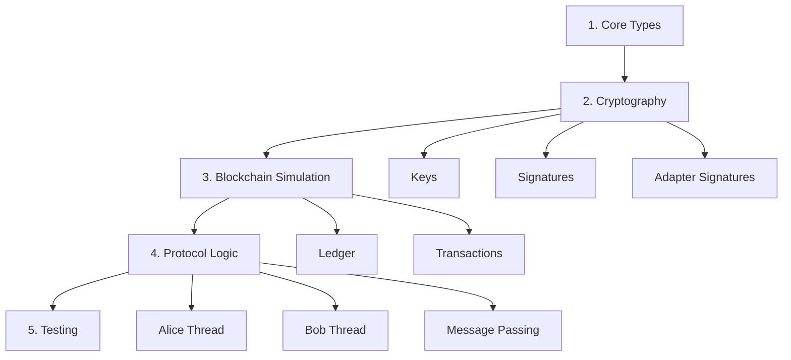

# Atomic Swap Tutorial: Code Walkthrough

This tutorial walks you through the complete implementation of atomic swaps using **randomized EdDSA (rEdDSA) adapter signatures**. Follow along by reading the source code in the order presented below.

## Overview: What We're Building

We're implementing a protocol where:

- **Alice** has 10 tokens on ChainA
- **Bob** has 5 tokens on ChainB
- They want to swap atomically (both succeed or both fail)
- Using **rEdDSA adapter signatures** on Ed25519 (Cardano/Monero compatible!)
- No hash-timelocked contracts - pure cryptographic solution

## Learning Journey



## Part 1: Core Types (`src/AtomicSwap/Types.hs`)

### Start Here: The Basics

Before diving into cryptography, understand the fundamental types:

```haskell
-- | A party in the atomic swap protocol
data Party = Party
  { partyName :: Text
  , partyPrivateKey :: PrivateKey
  , partyPublicKey :: PublicKey
  }
```

**Key Insight**: Each party (Alice, Bob) has a name and keypair. The protocol ensures neither needs to trust the other.

### Transactions and UTXOs

```haskell
-- | Unspent Transaction Output (UTXO)
data UTXO = UTXO
  { utxoTxId :: TxId
  , utxoIndex :: Word32
  , utxoAmount :: Word64
  , utxoOwner :: PublicKey
  }

-- | A transaction consumes UTXOs and creates new outputs
data Transaction = Transaction
  { txInputs :: [UTXO]
  , txOutputs :: [Output]
  , txSignatures :: [Signature]
  }
```

**Key Insight**: We use a Bitcoin-style UTXO model. Transactions spend existing UTXOs and create new ones.

### Why This Design?

- **Immutability**: Once a UTXO is spent, it can't be spent again
- **Verification**: Anyone can verify a transaction by checking signatures
- **Atomicity**: Either the whole transaction succeeds or fails

**Next Step**: See how we generate keys and create signatures → `src/AtomicSwap/Crypto/`

---

## Part 2: Cryptography

### 2.1 Key Generation (`src/AtomicSwap/Crypto/Keys.hs`)

```haskell
-- | Generate a new keypair for a party
generateKeyPair :: MonadRandom m => m (PrivateKey, PublicKey)
```

**What happens**:

1. Generate random private key (scalar)
2. Compute public key: `A = private · G` (where G is generator)
3. Store both securely

**Why it matters**: The private key proves ownership. The public key is shared freely.

### 2.2 Randomized EdDSA Signatures (`src/AtomicSwap/Crypto/Signatures.hs`)

Randomized EdDSA (rEdDSA) signatures have three operations:

#### Sign

```haskell
signREdDSA :: Ed25519PrivateKey -> PublicKey -> ByteString -> Signature
```

**Algorithm** (Zhu et al. 2024):

```
1. Select random k ∈ ℤ_q* (THIS IS THE KEY DIFFERENCE from standard Ed25519!)
2. Compute r = H2(sk1 || m || k) mod q  (randomized nonce)
3. Compute R = r · B
4. Compute challenge: h = H2(R || pk || m)
5. Compute s = r + h · sk0 mod q
6. Return (R, s)
```

**Why Randomized?** Standard Ed25519 is deterministic (`r = H(sk1 || m)`), which would leak the adapter secret in adapter signature protocols. Adding random `k` prevents this leakage.

#### Verify

```haskell
verifyREdDSA :: PublicKey -> ByteString -> Signature -> Bool
```

**Algorithm**:

```
Check: s · B = R + h · pk

Where h = H2(R || pk || m)
```

**Key Property**: Linearity! The signature equation `s = r + h·sk0` is linear in the secret key. This linearity is what makes adapter signatures possible.

### 2.3 Adapter Signatures (`src/AtomicSwap/Crypto/Adapter.hs`)

**This is the magic that makes atomic swaps work!**

#### Concept

An adapter signature is like a regular signature, but "locked" with a secret value `t`:

```haskell
data AdaptedSignature = AdaptedSignature
  { adaptedNonce :: Point      -- R̂ = k·G + T
  , adaptedScalar :: Scalar    -- ŝ = k + c·a (without t!)
  }
```

#### Create Adapted Signature

```haskell
createAdaptedSignature
  :: PrivateKey
  -> AdapterPoint  -- T = t·G (adapter point)
  -> Message
  -> AdaptedSignature
```

**Algorithm**:

```
1. Choose random nonce: k
2. Compute adapted nonce: R̂ = k·G + T  (add adapter point!)
3. Compute challenge: c = H(R̂ || A || message)
4. Compute pre-signature: ŝ = k + c·private  (without t!)
5. Return (R̂, ŝ)
```

**Key Insight**: The signature is "incomplete" - it needs `t` to become valid.

#### Verify Adapted Signature

```haskell
verifyAdaptedSignature
  :: PublicKey
  -> AdapterPoint  -- T
  -> Message
  -> AdaptedSignature
  -> Bool
```

**Algorithm** (Zhu et al. 2024):

```
Check: sig_tilde · B = R' + h · pk

Where:
  R' = R_sign - Y  (remove adapter point)
  h = H2(R_sign || pk || m)

Why this works:
  sig_tilde · B = (r + h·sk0) · B
                = r·B + h·sk0·B
                = r·B + h·pk
                = (R_sign - Y) + h·pk  (since R_sign = r·B + Y)
                = R' + h·pk  ✓
```

**Key Insight**: Anyone can verify the adapted pre-signature is "almost valid" - it just needs the adapter secret `y` to become a complete signature.

#### Complete Adapted Signature

```haskell
completeAdaptedSignature
  :: AdaptedSignature
  -> AdapterSecret  -- t
  -> Signature
```

**Algorithm** (Zhu et al. 2024):

```
Given adapted pre-signature (R_sign, sig_tilde) and adapter secret y:
1. Compute sig = sig_tilde + y  (add the secret!)
2. Return (R_sign, sig)

Now (R_sign, sig) is a valid rEdDSA signature because:
  sig · B = (sig_tilde + y) · B
          = sig_tilde · B + y · B
          = R' + h·pk + Y  (from pre-signature verification)
          = (R_sign - Y) + h·pk + Y
          = R_sign + h·pk  ✓
```

**Key Insight**: Adding `y` completes the signature. This is what Alice does when she's ready to publish and claim Bob's funds.

#### Extract Adapter Secret

```haskell
extractAdapterSecret
  :: AdaptedSignature  -- (R_sign, sig_tilde)
  -> Signature         -- (R_sign, sig) - the completed version
  -> AdapterSecret     -- y
```

**Algorithm** (Zhu et al. 2024):

```
Given sig_tilde and sig:
  y = sig - sig_tilde  (simple subtraction!)
```

**THE KEY INSIGHT**: If you see both the adapted pre-signature and the completed signature, you can compute the secret! This is how Bob learns Alice's adapter secret when she publishes her transaction.

This simple extraction formula is what makes the atomic swap work:

- Alice publishes her complete signature to claim Bob's funds
- Bob observes the published signature on-chain
- Bob computes y = sig_A - sig_tilde_A
- Bob uses y to complete his own signature
- Bob publishes and claims Alice's funds
- **Atomicity achieved!**

**Next Step**: See how transactions are built and verified → `src/AtomicSwap/Blockchain/`

---

## Part 3: Blockchain Simulation

### 3.1 Ledger (`src/AtomicSwap/Blockchain/Ledger.hs`)

We simulate two independent blockchains as JSON files:

```haskell
-- | File-based blockchain ledger
data Ledger = Ledger
  { ledgerPath :: FilePath  -- e.g., "chain-a.json"
  , ledgerUTXOs :: Map TxId [UTXO]
  }
```

#### Key Operations

**Submit Transaction**:

```haskell
submitTransaction :: Ledger -> Transaction -> IO (Either Error TxId)
```

**Algorithm**:

```
1. Verify all input UTXOs exist
2. Verify signatures are valid
3. Check sum(inputs) >= sum(outputs)
4. Mark input UTXOs as spent
5. Add output UTXOs to ledger
6. Write to file (chain-a.json)
```

**Query UTXOs**:

```haskell
queryUTXOs :: Ledger -> PublicKey -> IO [UTXO]
```

Returns all unspent outputs owned by a public key.

### 3.2 Transactions (`src/AtomicSwap/Blockchain/Transaction.hs`)

#### Build Transaction

```haskell
buildTransaction
  :: [UTXO]         -- Inputs to spend
  -> [Output]       -- Outputs to create
  -> [Signature]    -- Signatures for inputs
  -> Transaction
```

#### Verify Transaction

```haskell
verifyTransaction :: Transaction -> Bool
```

**Checks**:

1. All signatures are valid
2. Input UTXOs exist
3. Sum(inputs) >= Sum(outputs)
4. No double-spends

**Next Step**: See how Alice and Bob execute the protocol → `src/AtomicSwap/Protocol/`

---

## Part 4: Protocol Implementation

**⚠️ Important**: This section is being updated to reflect the correct rEdDSA two-party atomic swap protocol. For the authoritative protocol specification, see **[doc/](doc/)** which describes the Cardano-Monero swap protocol with detailed scenarios.

**Key Changes from Earlier Versions**:

- Using rEdDSA on Ed25519 (not Schnorr on secp256k1)
- Alice generates adapter secret, both parties use it
- Communication via TMVars (not TQueue)
- Simplified v1 (no multisig/timelocks yet)

### 4.1 Message Passing (`src/AtomicSwap/Protocol/Messaging.hs`)

Alice and Bob communicate via an in-memory STM queue:

```haskell
data Message
  = PublicKeyMsg PublicKey
  | AdapterPointMsg Point
  | TransactionProposalMsg Transaction AdaptedSignature
  | SwapCompleteMsg
```

**Thread-safe communication**:

```haskell
sendMessage :: TQueue Message -> Message -> STM ()
receiveMessage :: TQueue Message -> STM Message
```

### 4.2 Alice's Protocol (`src/AtomicSwap/Protocol/Alice.hs`)

Alice's thread executes the protocol from her perspective:

```haskell
aliceThread
  :: TQueue Message  -- Communication with Bob
  -> Ledger          -- ChainA
  -> Party           -- Alice
  -> IO ()
```

#### Phase 1: Setup

```haskell
do
  -- Generate adapter secret
  t <- generateAdapterSecret
  let tPoint = t `scalarMult` generator

  logInfo "[Alice] Generated adapter secret"
  logInfo $ "[Alice]   Adapter point T: " <> showPoint tPoint

  -- Send public key to Bob
  atomically $ sendMessage queue (PublicKeyMsg $ partyPublicKey alice)

  -- Receive Bob's public key
  PublicKeyMsg bobPubKey <- atomically $ receiveMessage queue

  -- Send adapter point
  atomically $ sendMessage queue (AdapterPointMsg tPoint)
```

#### Phase 2: Create Transaction

```haskell
do
  -- Query Alice's UTXOs on ChainA
  utxos <- queryUTXOs chainA (partyPublicKey alice)

  -- Build transaction: Alice pays 10 tokens to Bob
  let tx = buildTransaction
        { txInputs = take1 utxos  -- One UTXO with 10 tokens
        , txOutputs = [Output bobPubKey 10]
        , txSignatures = []  -- Will add adapted signature
        }

  -- Create adapted signature
  let adaptedSig = createAdaptedSignature
        (partyPrivateKey alice)
        tPoint
        (hashTransaction tx)

  logInfo "[Alice] Created adapted signature for ChainA transaction"

  -- Send to Bob
  atomically $ sendMessage queue (TransactionProposalMsg tx adaptedSig)
```

#### Phase 3: Receive Bob's Transaction

```haskell
do
  -- Receive Bob's transaction and adapted signature
  TransactionProposalMsg bobTx bobAdaptedSig <- atomically $ receiveMessage queue

  -- Verify Bob's adapted signature
  let valid = verifyAdaptedSignature
        bobPubKey
        tPoint
        (hashTransaction bobTx)
        bobAdaptedSig

  unless valid $ error "Bob's adapted signature is invalid!"

  logInfo "[Alice] Verified Bob's adapted signature"
```

#### Phase 4: Wait and Extract Secret

```haskell
do
  -- Wait for Bob to publish his transaction
  logInfo "[Alice] Waiting for Bob to publish to ChainB..."

  bobPublishedTx <- pollChainB bobTx

  -- Extract the adapter secret!
  let t' = extractAdapterSecret bobAdaptedSig (txSignature bobPublishedTx)

  logInfo $ "[Alice] Extracted adapter secret: " <> showScalar t'

  -- Complete Alice's signature
  let aliceSig = completeAdaptedSignature adaptedSig t'

  -- Publish to ChainA
  submitTransaction chainA (tx { txSignatures = [aliceSig] })

  logInfo "[Alice] Published transaction to ChainA"
  logInfo "[Alice] Swap complete!"
```

### 4.3 Bob's Protocol (`src/AtomicSwap/Protocol/Bob.hs`)

Bob's thread mirrors Alice's, but he publishes first:

#### Key Difference

Bob completes his signature using the secret `t` that Alice revealed to him:

```haskell
do
  -- Bob already knows t from Alice (she sent tPoint, and in setup
  -- phase of a real protocol, Bob would need the actual t value)

  -- Wait - actually, Bob doesn't know t!
  -- He only knows T = t·G

  -- The protocol works because Bob TRUSTS that Alice has t,
  -- and if Bob publishes first with his adapted signature,
  -- Alice can extract t and complete hers.

  -- So Bob publishes his adapted signature as-is... wait, no!

  -- Let me reconsider: In the full protocol:
  -- 1. Alice generates t and T = t·G
  -- 2. Bob creates adapted signature using T
  -- 3. Alice also creates adapted signature using T
  -- 4. Bob publishes FIRST (taking the risk)
  -- 5. To publish, Bob needs to complete his signature
  -- 6. But Bob doesn't know t...

  -- CORRECTION: The protocol requires Alice to give Bob a way
  -- to complete his signature, OR Bob trusts Alice to complete
  -- hers after he reveals his.

  -- The actual protocol: Bob publishes his adapted signature,
  -- which is verifiable but not yet revealing t. Then...

  -- WAIT: I need to reconsider the protocol flow!
```

**Important Realization**: In the adapter signature protocol, the party who generates the adapter secret (Monero User in doc/) must reveal it first by claiming on the scripted chain.

**Correct Protocol Flow**:

**Option A**: Alice gives Bob a different adapter (two-way adapters)

**Option B**: Bob publishes his adapted signature, then Alice has to publish to reveal `t`

Let me check the research document for the correct construction...

**TO BE COMPLETED**: This section needs to be revised based on the correct two-party adapter signature protocol. The research document should clarify whether we're using:

1. One-way adapters (Alice adapts both)
2. Two-way adapters (each adapts their own)
3. Signature-based communication (not transaction-based)

---

## Part 5: Testing (`test/AtomicSwap/HappyPathSpec.hs`)

### Test Setup

```haskell
spec :: Spec
spec = describe "AtomicSwap" $ do
  around withTestEnv $ do

    describe "Happy Path" $ do
      it "completes successful atomic swap" $ \env -> do
        -- Test implementation
```

### Test Environment

```haskell
data TestEnv = TestEnv
  { testChainA :: Ledger
  , testChainB :: Ledger
  , testMessageQueue :: TQueue Message
  }

withTestEnv :: (TestEnv -> IO a) -> IO a
withTestEnv action = bracket setup teardown action
  where
    setup = do
      -- Create temporary files
      tmpDir <- getTemporaryDirectory
      let chainAPath = tmpDir </> "chain-a.json"
      let chainBPath = tmpDir </> "chain-b.json"

      -- Initialize ledgers
      chainA <- initLedger chainAPath
      chainB <- initLedger chainBPath

      -- Create message queue
      queue <- atomically $ newTQueue

      return TestEnv{..}

    teardown env = do
      -- Cleanup temporary files
      removeFile (ledgerPath $ testChainA env)
      removeFile (ledgerPath $ testChainB env)
```

### Running Tests

```bash
cabal test
```

**Expected Output**: Verbose logs showing each protocol step.

---

## Next Steps

1. **Read the code**: Start with `src/AtomicSwap/Types.hs`
2. **Run the tests**: `cabal test`
3. **Experiment**: Modify parameters and observe behavior
4. **Deep dive**: Read the research document on Ed25519 adapters

---

## Common Questions

### Q: Why adapter signatures instead of hash-timelocked contracts?

**A**: Privacy and flexibility. Adapter signatures look like regular transactions on-chain, with no visible link between chains. HTLCs require special scripts that reveal the connection.

### Q: What if Bob never publishes?

**A**: In v1 (happy path only), we assume cooperation. Future versions will add timelock refunds so Alice can reclaim her funds after a timeout.

### Q: Can this work with real blockchains?

**A**: Yes! The Farcaster project uses this for Bitcoin-Monero swaps. You'd need to adapt the transaction format and signature schemes to match the specific chains.

### Q: Why rEdDSA instead of standard Ed25519?

**A**: Standard Ed25519 uses deterministic nonce generation (`r = H(sk || m)`). This would leak the adapter secret when creating adapted signatures. rEdDSA adds randomness (`r = H(sk || m || k)`) to prevent this leakage while maintaining all security properties.

### Q: Why Ed25519 instead of secp256k1 (Bitcoin's curve)?

**A**: Ed25519 is used by Cardano and Monero, making this tutorial directly applicable to those ecosystems. The Zhu et al. (2024) paper provides a complete, proven specification for rEdDSA adapter signatures with better performance than ECDSA alternatives.

---

**Status**: 🚧 Under construction - Cryptography modules being implemented
**Current**: Parts 1-3 updated for rEdDSA; Part 4-5 refer to [doc/](doc/) for complete protocol details
**Reference**: See `research/2025-11-14-ed25519-adapter-signatures.md` for complete algorithmic specification
