# Happy Path: Successful Atomic Swap

> **Outcome**: Both parties successfully exchange assets
> **Key Learning**: Adapter signatures create atomic linkage across chains

## Story Summary

Cardano User wants to exchange 100 ADA for 1 XMR. Monero User wants the opposite. Through careful cryptographic coordination, they complete a trustless exchange where neither party can cheat the other.

---

## Parties and Motivation

### Monero User (XMR Holder)

- **Starting Balance**: 0 ADA, 1 XMR
- **Goal**: Exchange 1 XMR for 100 ADA
- **Special Role**: Generates adapter secret `y`, controls swap completion timing
- **Risk**: Must trust that Cardano User locked ADA before locking XMR

### Cardano User (ADA Holder)

- **Starting Balance**: 100 ADA, 0 XMR
- **Goal**: Exchange 100 ADA for 1 XMR
- **Special Role**: Locks first on scripted chain, waits for `y` revelation
- **Risk**: Funds locked with timelocks, must wait for Monero User to act

---

## Protocol Parameters

| Parameter                  | Value                  | Rationale                              |
| -------------------------- | ---------------------- | -------------------------------------- |
| Swap Amount (Cardano User) | 100 ADA                | Cardano User's contribution            |
| Swap Amount (Monero User)  | 1 XMR                  | Monero User's contribution             |
| Timelock t₁                | ~12 hours              | Cancel window (not used in happy path) |
| Timelock t₂                | ~24 hours after cancel | Punish window (not used in happy path) |

---

## Timeline Visualization

```
═══════════════════════════════════════════════════════════════════════════════
SETUP PHASE (Off-Chain)
═══════════════════════════════════════════════════════════════════════════════

T-2 hours:   📝 Monero User generates adapter secret y
             └─ Computes Y = y·B, shares Y with Cardano User

T-1 hour:    🔑 Key exchange
             ├─ Cardano User sends: Cardano pubkey, Monero key share
             └─ Monero User sends: Cardano pubkey, Monero key share

T-30 min:    ✍️  Pre-signature creation
             ├─ Cardano User creates Buy pre-sig (adapted by Y)
             └─ Monero User creates Cancel pre-sig (adapted by Cardano key)

═══════════════════════════════════════════════════════════════════════════════
LOCK PHASE (On-Chain)
═══════════════════════════════════════════════════════════════════════════════

T=0:         🔒 Cardano User locks 100 ADA on Cardano
             └─ Plutus script with Buy/Cancel/Punish paths

T+10 min:    ✅ Monero User verifies Cardano lock
             └─ Confirms: amount, script params, timelocks

T+20 min:    🔒 Monero User locks 1 XMR on Monero
             └─ 2-of-2 multisig (S_total = S_cardano + S_monero)

T+30 min:    ✅ Cardano User verifies Monero lock
             └─ Confirms: amount, multisig address

═══════════════════════════════════════════════════════════════════════════════
RESOLUTION PHASE (On-Chain) - HAPPY PATH
═══════════════════════════════════════════════════════════════════════════════

T+1 hour:    🔓 Monero User claims ADA on Cardano
             ├─ Publishes Buy transaction with σ = σ̃ + y
             └─ Adapter secret y is now PUBLIC on Cardano blockchain

T+1.5 hours: 🔍 Cardano User extracts adapter secret
             ├─ Reads Buy tx from Cardano blockchain
             ├─ Computes: y = σ - σ̃ (has σ̃ from setup)
             └─ Verifies: Y = y·B ✓

T+2 hours:   🔓 Cardano User claims XMR on Monero
             ├─ Completes Monero spend signature using y
             └─ Spends 2-of-2 multisig to own address

═══════════════════════════════════════════════════════════════════════════════
SWAP COMPLETE
═══════════════════════════════════════════════════════════════════════════════
```

---

## Narrative Flow

### Act I: Setup (Off-Chain)

**Scene 1: Secret Generation**

Monero User generates the adapter secret that will link both chains:

```
y ← random 32-byte scalar
Y = y·B  (Ed25519 point multiplication)
```

Monero User shares `Y` (public commitment) but keeps `y` secret. This commitment proves Monero User knows `y` without revealing it.

**Scene 2: Key Exchange**

Both parties exchange the keys needed for both blockchains:

- **Cardano keys**: Standard Ed25519 signing keys for ADA transactions
- **Monero key shares**: Each party provides half of the 2-of-2 multisig key

The combined Monero spend key is: `S_total = S_cardano + S_monero`

**Scene 3: Pre-signature Creation**

Pre-signatures are created for all possible transaction paths:

| Pre-signature | Created By   | Adapted By                   | Purpose                                |
| ------------- | ------------ | ---------------------------- | -------------------------------------- |
| Buy           | Cardano User | Y (Monero User's commitment) | Allows Monero User to claim ADA        |
| Cancel        | Monero User  | Cardano User's key           | Allows Cardano User to initiate refund |
| Punish        | Cardano User | None                         | Allows Monero User to punish if needed |

### Act II: Lock Phase (On-Chain)

**Scene 4: Cardano User Locks First**

Cardano User creates a Lock transaction on Cardano:

```
Lock UTXO:
├─ Value: 100 ADA
├─ Script: Plutus validator with three paths
└─ Datum:
   ├─ Y: adapter point (Monero User's commitment)
   ├─ pk_cardano: Cardano User's public key
   ├─ pk_monero: Monero User's public key
   ├─ t₁: cancel timelock
   └─ t₂: punish timelock
```

**Scene 5: Monero User Verifies and Locks**

After confirming the Cardano lock:

1. Monero User checks Lock UTXO exists with correct parameters
2. Waits for sufficient confirmations (e.g., 6 blocks)
3. Creates 2-of-2 multisig address on Monero
4. Funds multisig with 1 XMR

```
Monero 2-of-2 Multisig:
├─ Amount: 1 XMR
├─ Spend key: S_total = S_cardano + S_monero
└─ Requires: Both signatures OR key extraction
```

### Act III: Resolution (Happy Path)

**Scene 6: Monero User Claims ADA**

Monero User decides to complete the swap:

1. Takes the Buy pre-signature `σ̃` from Cardano User
2. Completes it with adapter secret: `σ = σ̃ + y`
3. Submits Buy transaction to Cardano

```
Buy Transaction:
├─ Input: Lock UTXO (100 ADA)
├─ Output: Monero User's address (100 ADA)
├─ Redeemer: Buy action
└─ Witness: Adapted signature σ = σ̃ + y
```

**Critical Moment**: When this transaction is published, the adapter secret `y` becomes public!

**Scene 7: Cardano User Extracts Secret**

Cardano User observes the Buy transaction on Cardano blockchain:

1. Reads the adapted signature `σ` from the transaction
2. Has the pre-signature `σ̃` from setup phase
3. Computes: `y = σ - σ̃` (scalar subtraction)
4. Verifies: `Y = y·B` matches the original commitment

**Scene 8: Cardano User Claims XMR**

With the extracted adapter secret `y`, Cardano User can now complete the Monero transaction:

1. Computes: `s_monero_complete = s_monero_partial + y`
2. Creates full Monero spend signature
3. Submits spend transaction to Monero network
4. Receives 1 XMR at their address

---

## Sequence Diagram

```mermaid
sequenceDiagram
    participant MU as Monero User
    participant Cardano as Cardano Chain
    participant Monero as Monero Chain
    participant CU as Cardano User

    Note over MU,CU: Setup Phase (Off-Chain)
    MU->>MU: Generate y, compute Y = y·B
    MU->>CU: Share Y (adapter point)
    MU->>CU: Exchange keys
    CU->>MU: Buy pre-signature (adapted by Y)
    MU->>CU: Cancel pre-signature

    Note over MU,CU: Lock Phase (On-Chain)
    CU->>Cardano: Lock 100 ADA (Plutus script)
    Cardano-->>MU: Verify lock confirmed
    MU->>Monero: Lock 1 XMR (2-of-2 multisig)
    Monero-->>CU: Verify lock confirmed

    Note over MU,CU: Resolution Phase (Happy Path)
    MU->>MU: Complete signature: σ = σ̃ + y
    MU->>Cardano: Buy tx (reveals y in σ)
    Cardano-->>MU: 100 ADA transferred
    CU->>Cardano: Read Buy tx
    CU->>CU: Extract y = σ - σ̃
    CU->>Monero: Spend with extracted y
    Monero-->>CU: 1 XMR transferred

    Note over MU,CU: Swap Complete!
```



---

## Balance Sheet

| Party            | Before         | After          | Net Change       |
| ---------------- | -------------- | -------------- | ---------------- |
| **Cardano User** | 100 ADA, 0 XMR | 0 ADA, 1 XMR   | -100 ADA, +1 XMR |
| **Monero User**  | 0 ADA, 1 XMR   | 100 ADA, 0 XMR | +100 ADA, -1 XMR |

---

## Key Insights

### 1. Atomic Linkage

The adapter signature creates an unbreakable link between the two chains:

- Monero User **cannot** claim ADA without revealing `y`
- Once `y` is revealed, Cardano User **can always** extract it
- Cardano User **cannot** claim XMR without `y`

### 2. No Trust Required

Neither party trusts the other:

- Cardano User locks first, but has Cancel/Punish protection
- Monero User locks second, but only after verifying Cardano lock
- Swap completion is cryptographically enforced

### 3. Order Independence

Once both parties lock:

- Monero User can claim anytime (before t₁)
- Cardano User can extract `y` as soon as Buy tx is published
- No coordination needed for resolution

### 4. Incentive Alignment

Both parties are economically motivated to complete:

- Monero User wants their 100 ADA
- Cardano User wants their 1 XMR
- Griefing only wastes time/fees with no profit

---

## Technical Notes

<details>
<summary>Cryptographic Details</summary>

### Adapter Signature Math

Pre-signature creation (Cardano User):

```
k ← random nonce
R = k·B + Y  (adapted nonce point)
c = H(R || pk || msg)
σ̃ = k + c·sk  (pre-signature, missing y)
```

Signature completion (Monero User):

```
σ = σ̃ + y  (add adapter secret)
```

Verification:

```
R' = σ·B - c·pk
Verify: R' == R  (which includes Y)
```

Secret extraction (Cardano User):

```
y = σ - σ̃  (scalar subtraction)
Verify: Y == y·B
```

### Plutus Script Logic

```haskell
-- Simplified Buy path validation
validateBuy :: Datum -> Redeemer -> ScriptContext -> Bool
validateBuy datum Buy ctx =
    -- Check signature is valid adapted signature
    verifyAdaptedSignature (adapterPoint datum) sig msg
    &&
    -- Check outputs go to correct address
    valuePaidTo ctx (moneroUserPkh datum) >= lockAmount datum
```

</details>

---

## What Could Go Wrong?

In the happy path, nothing goes wrong. But the protocol is designed to handle failures:

| Failure Mode                            | Protection      | See Document                                                           |
| --------------------------------------- | --------------- | ---------------------------------------------------------------------- |
| Monero User never claims                | Cancel after t₁ | [02-monero-user-griefs.md](02-monero-user-griefs.md)                   |
| Cardano User never locks                | Lock order      | [03-cardano-user-never-locks.md](03-cardano-user-never-locks.md)       |
| Cardano User cancels but doesn't refund | Punish after t₂ | [04-cardano-user-locks-abandons.md](04-cardano-user-locks-abandons.md) |
| Network issues                          | Cancel + Refund | [05-technical-failure.md](05-technical-failure.md)                     |

---

## Next: What if Monero User doesn't claim?

Continue to [02-monero-user-griefs.md](02-monero-user-griefs.md) to see how the Cancel mechanism protects Cardano User.
