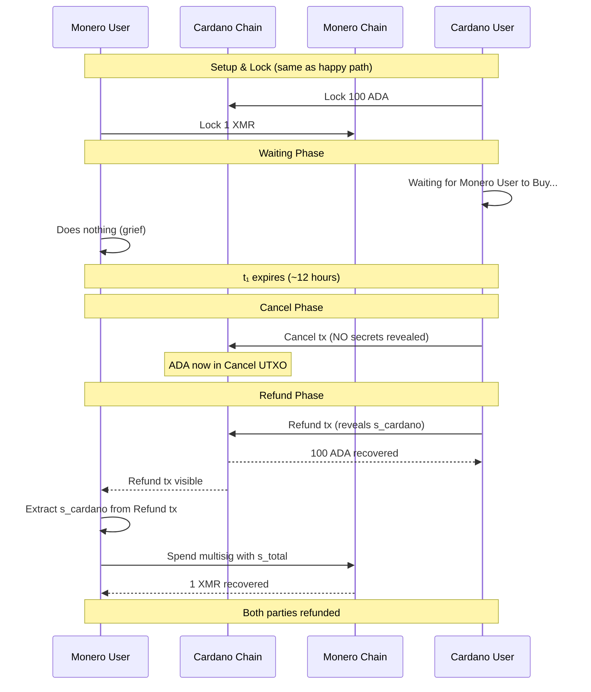

# Monero User Griefs: Cancel and Refund

> **Outcome**: Both parties refunded, no swap occurs<br>
> **Key Learning**: Cancel + Refund mechanism protects both parties from indefinite lock

## Story Summary

After both parties lock their funds, Monero User decides not to complete the swap. Perhaps they changed their mind, found a better deal, or simply want to waste Cardano User's time. The Cancel mechanism ensures Cardano User can initiate abort, and the Refund transaction reveals `s_cardano` which enables Monero User to recover their XMR.

---

## Parties and Motivation

### Monero User (The Griefer)

- **Starting Balance**: 0 ADA, 1 XMR
- **Intention**: Lock XMR but never reveal adapter secret `y`
- **Motivation**: Grief (waste time), or legitimate change of mind
- **Outcome**: Recovers XMR, wastes time/fees

### Cardano User (The Victim)

- **Starting Balance**: 100 ADA, 0 XMR
- **Situation**: Locked ADA, waiting for Monero User to Buy
- **Protection**: Cancel + Refund mechanism after timelock t₁
- **Outcome**: Recovers ADA after delay

---

## Protocol Parameters

| Parameter                  | Value                  | Role in This Scenario        |
| -------------------------- | ---------------------- | ---------------------------- |
| Swap Amount (Cardano User) | 100 ADA                | Locked, eventually recovered |
| Swap Amount (Monero User)  | 1 XMR                  | Locked, eventually recovered |
| Timelock t₁                | ~12 hours              | When Cardano User can Cancel |
| Timelock t₂                | ~24 hours after Cancel | Not reached (honest refund)  |

---

## Timeline Visualization

```
═══════════════════════════════════════════════════════════════════════════════
SETUP & LOCK PHASES (Same as Happy Path)
═══════════════════════════════════════════════════════════════════════════════

T=0:         🔒 Cardano User locks 100 ADA on Cardano
T+20 min:    🔒 Monero User locks 1 XMR on Monero

═══════════════════════════════════════════════════════════════════════════════
WAITING PHASE - MONERO USER DOESN'T BUY
═══════════════════════════════════════════════════════════════════════════════

T+1 hour:    ⏳ Cardano User waiting for Monero User to Buy...
T+6 hours:   ⏳ Still waiting...
T+11 hours:  ⏳ Approaching t₁ timelock...

═══════════════════════════════════════════════════════════════════════════════
CANCEL PHASE - CARDANO USER INITIATES ABORT
═══════════════════════════════════════════════════════════════════════════════

T+12 hours:  ⏰ Timelock t₁ expires - Cancel window opens
             └─ Cardano User can now publish Cancel transaction

T+12.5 hours: 🔄 Cardano User publishes Cancel transaction
              ├─ Moves ADA to Cancel UTXO
              ├─ NO secrets revealed yet
              └─ Commits to abort path (Buy no longer possible)

═══════════════════════════════════════════════════════════════════════════════
REFUND PHASE - BOTH PARTIES RECOVER FUNDS
═══════════════════════════════════════════════════════════════════════════════

T+13 hours:  🔓 Cardano User publishes Refund transaction
             ├─ Refund uses adaptor signature
             └─ Reveals s_cardano (Cardano User's Monero key share)

T+13.5 hours: 🔍 Monero User extracts Cardano User's key share
              ├─ Reads Refund tx from Cardano blockchain
              └─ Computes: s_cardano = σ_refund - σ̃_refund

T+14 hours:  🔓 Monero User recovers XMR from Monero multisig
             ├─ Has both key shares: s_total = s_cardano + s_monero
             └─ Spends 2-of-2 multisig unilaterally

═══════════════════════════════════════════════════════════════════════════════
REFUND COMPLETE - NO SWAP OCCURRED
═══════════════════════════════════════════════════════════════════════════════

Final State:
├─ Cardano User: 100 ADA recovered
└─ Monero User: 1 XMR recovered
```

---

## Narrative Flow

### Act I: The Wait

After both parties lock their funds, the protocol enters a waiting period. In the happy path, Monero User would Buy ADA within hours. But in this scenario:

**Monero User does nothing.**

They simply wait, letting time pass. Perhaps they:

- Changed their mind about the swap
- Found a better exchange rate elsewhere
- Want to grief Cardano User
- Experienced a technical failure (covered in [05-technical-failure.md](05-technical-failure.md))

From Cardano User's perspective, there's no way to distinguish between "Monero User is taking their time" and "Monero User will never Buy."

### Act II: Cancel Window Opens

After timelock t₁ expires (~12 hours), Cardano User gains the ability to initiate a cancel:

**The Cancel Transaction**

```
Cancel Transaction:
├─ Input: Lock UTXO (100 ADA)
├─ Output: Cancel UTXO (100 ADA, different script)
├─ Redeemer: Cancel action
├─ Timelock: Must be after t₁
└─ Witness: Cardano User's signature (standard, NO adaptor)
```

**Critical**: Cancel does NOT reveal any secrets. It only commits to the abort path and eliminates the Buy option.

### Act III: Refund Reveals Key Share

After Cancel is confirmed, Cardano User publishes Refund to get their ADA back:

**The Refund Transaction**

```
Refund Transaction:
├─ Input: Cancel UTXO (100 ADA)
├─ Output: Cardano User's address (100 ADA)
└─ Witness: Adaptor signature σ_refund = σ̃_refund + s_cardano
```

**Critical Detail**: The Refund transaction uses an **adaptor signature** that reveals Cardano User's Monero private key share!

This is intentional:

- Cardano User must reveal their key share to get their ADA back
- This enables Monero User to recover XMR
- Without this, Monero User's XMR would be stuck forever

### Act IV: Monero User Recovers XMR

**Monero User Extracts Key Share**

When Refund is published on Cardano:

1. Monero User observes Refund transaction
2. Reads the adaptor signature `σ_refund`
3. Has the pre-signature `σ̃_refund` from setup
4. Computes: `s_cardano = σ_refund - σ̃_refund`

Now Monero User has both halves of the Monero spend key:

```
s_total = s_cardano + s_monero
```

**Monero User Recovers XMR**

With the complete spend key, Monero User can spend the 2-of-2 multisig unilaterally:

1. Creates Monero spend transaction
2. Signs with complete key `s_total`
3. Receives 1 XMR back at their address

---

## Sequence Diagram



---

## Balance Sheet

| Party            | Before         | After          | Net Change      |
| ---------------- | -------------- | -------------- | --------------- |
| **Cardano User** | 100 ADA, 0 XMR | 100 ADA, 0 XMR | ±0 (minus fees) |
| **Monero User**  | 0 ADA, 1 XMR   | 0 ADA, 1 XMR   | ±0 (minus fees) |

---

## Key Insights

### 1. No Profit from Griefing

Monero User gains nothing from this grief attempt:

- They don't get Cardano User's ADA
- They don't keep their XMR locked (they recover it)
- They only waste time and transaction fees

**Economic conclusion**: This grief is irrational unless Monero User has external motivation (spite, market manipulation, etc.)

> **Note (Implicit Option Value)**: During the swap window, Monero User holds an implicit
> American call option on ADA—they can observe price movements and decide whether to
> complete the swap. This "free look" period has economic value not captured in simple
> balance sheets. Minimizing t₁ reduces this asymmetry.

### 2. Refund Enables Monero Recovery

The Refund transaction is cleverly designed:

- It's the only way Cardano User can recover ADA from Cancel UTXO
- But it **must** reveal Cardano User's Monero key share
- This atomically enables Monero User to recover XMR

Without this linkage, Monero User's XMR would be stuck forever in the 2-of-2 multisig.

### 3. Two-Step Abort (Cancel then Refund)

Why two transactions instead of one?

**Cancel**: Commits to abort path, eliminates Buy race condition
**Refund**: Reveals secret, enables Monero recovery

This separation:

- Protects Cardano User from Punish race (Cancel happens before t₂)
- Creates clear protocol state transitions
- Allows time for both parties to prepare

### 4. Time Cost is the Only Penalty

For Monero User grief:

| Penalty          | Cardano User                | Monero User               |
| ---------------- | --------------------------- | ------------------------- |
| Time wasted      | ~12-14 hours                | ~12-14 hours              |
| Transaction fees | Lock + Cancel + Refund fees | Lock + Monero refund fees |
| Funds lost       | None                        | None                      |

Both parties lose time, but neither loses funds.

### 5. Indistinguishable from Technical Failure

This scenario is **identical** to technical failure from the protocol's perspective:

- Monero User intentionally not buying
- Monero User's software crashed
- Monero User lost internet connection

The protocol treats all of these the same way: Cancel + Refund.

---

## Technical Notes

<details>
<summary>Transaction Details</summary>

### Cancel Transaction

Cancel does NOT use an adaptor signature. It's a standard transaction:

```
Cancel tx:
├─ Requires: Cardano User's signature
├─ Timelock: After t₁
├─ Effect: Spends Lock UTXO, creates Cancel UTXO
└─ Secrets revealed: NONE
```

### Refund Adaptor Signature

During setup, Monero User creates an adaptor pre-signature for Refund:

```
σ̃_refund = adaptor_presign(msg_refund, S_cardano)
```

This pre-signature is encrypted with Cardano User's Monero public key share.

When Cardano User publishes Refund:

```
σ_refund = σ̃_refund + s_cardano
```

Monero User can extract:

```
s_cardano = σ_refund - σ̃_refund
```

### Cancel UTXO Script

The Cancel UTXO has a simpler script than the original Lock:

```haskell
-- Cancel UTXO validator
validateCancelUtxo :: Datum -> Redeemer -> ScriptContext -> Bool
validateCancelUtxo datum redeemer ctx = case redeemer of
    -- Cardano User can refund (reveals s_cardano via adaptor sig)
    Refund -> verifyAdaptorSignature ctx (cardanoUserPk datum)

    -- Monero User can punish (only if past t₂)
    Punish -> currentSlot ctx > punishTimelock datum
           && txSignedBy ctx (moneroUserPkh datum)
```

</details>

---

## Why Doesn't Punish Apply Here?

The Punish mechanism is designed for a different scenario:

| Scenario              | Cancel Published | Refund Published        | Punish Applies? |
| --------------------- | ---------------- | ----------------------- | --------------- |
| **This scenario**     | Yes              | Yes (reveals s_cardano) | No              |
| Cardano User abandons | Yes              | **No**                  | **Yes**         |

Punish only triggers if:

1. Cancel is published
2. Cardano User **doesn't** publish Refund
3. Time passes beyond t₂

In this scenario, Cardano User publishes Refund (to get their ADA back), which reveals `s_cardano`. Monero User extracts the key and recovers their XMR. No punishment needed.

---

## Comparison: Grief vs. Technical Failure

| Aspect            | Monero User Grief     | Technical Failure      |
| ----------------- | --------------------- | ---------------------- |
| Cause             | Intentional inaction  | Software/network issue |
| Protocol response | Cancel + Refund       | Cancel + Refund        |
| Outcome           | Both parties refunded | Both parties refunded  |
| Distinguishable?  | No                    | No                     |

The protocol is designed to be **safe** rather than trying to distinguish intent.

---

## Next: What if Cardano User never locks?

Continue to [03-cardano-user-never-locks.md](03-cardano-user-never-locks.md) to see how lock order prevents this grief vector.
