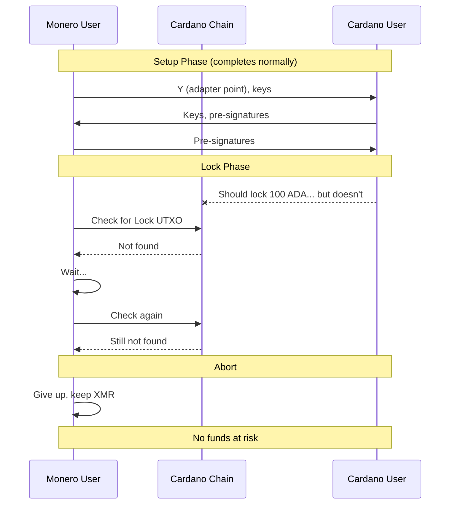

# Cardano User Never Locks: Protected by Lock Order

> **Outcome**: No funds at risk, no swap occurs<br>
> **Key Learning**: Lock order (scripted first) prevents this grief vector entirely

## Story Summary

Cardano User and Monero User complete the setup phase, exchanging keys and pre-signatures. But when it's time to lock funds, Cardano User disappears. Because the protocol requires the **scripted chain to lock first**, Monero User simply doesn't lock their XMR. No funds are ever at risk.

---

## Parties and Motivation

### Cardano User (The Would-Be Griefer)

- **Starting Balance**: 100 ADA, 0 XMR
- **Intention**: Complete setup but never lock ADA
- **Motivation**: Waste Monero User's time, reconnaissance, or cold feet
- **Outcome**: Nothing happens, wasted setup time

### Monero User (Protected by Design)

- **Starting Balance**: 0 ADA, 1 XMR
- **Situation**: Completed setup, waiting for Cardano lock
- **Protection**: Lock order - doesn't lock until Cardano User locks first
- **Outcome**: No risk, no loss

---

## Why This Scenario is Non-Threatening

Unlike other grief scenarios, this one is **trivially handled** by the lock order rule:

```
┌─────────────────────────────────────────────────────────────┐
│                      LOCK ORDER RULE                        │
├─────────────────────────────────────────────────────────────┤
│                                                             │
│   1. Cardano User (scripted chain) MUST lock first         │
│   2. Monero User (scriptless chain) locks ONLY AFTER       │
│      verifying Cardano lock is confirmed                    │
│                                                             │
│   If Cardano User never locks → Monero User never locks    │
│   Result: No funds at risk, swap simply doesn't happen     │
│                                                             │
└─────────────────────────────────────────────────────────────┘
```

---

## Timeline Visualization

```
═══════════════════════════════════════════════════════════════════════════════
SETUP PHASE (Off-Chain) - COMPLETES NORMALLY
═══════════════════════════════════════════════════════════════════════════════

T-2 hours:   📝 Monero User generates adapter secret y, shares Y
T-1 hour:    🔑 Key exchange completes
T-30 min:    ✍️  Pre-signatures created and verified

═══════════════════════════════════════════════════════════════════════════════
LOCK PHASE - CARDANO USER DISAPPEARS
═══════════════════════════════════════════════════════════════════════════════

T=0:         ❌ Cardano User supposed to lock ADA... but doesn't
             └─ No Lock transaction published

T+10 min:    ⏳ Monero User checks for Cardano lock...
             └─ Not found

T+30 min:    ⏳ Monero User checks again...
             └─ Still not found

T+1 hour:    ⏳ Monero User gives up waiting
             └─ Aborts swap, keeps XMR safely

═══════════════════════════════════════════════════════════════════════════════
NO SWAP - NO FUNDS AT RISK
═══════════════════════════════════════════════════════════════════════════════

Result:
├─ Cardano User: Still has 100 ADA (never locked)
├─ Monero User: Still has 1 XMR (never locked)
└─ Protocol state: Aborted during lock phase
```

---

## Narrative Flow

### Act I: Setup Completes

Both parties complete the setup phase:

1. Monero User generates adapter secret `y` and commitment `Y`
2. Both parties exchange Cardano and Monero keys
3. Pre-signatures are created for Buy, Cancel, and Punish
4. Both parties verify all pre-signatures

At this point, everything looks normal. The swap is ready to proceed.

### Act II: Waiting for Cardano Lock

According to the protocol, **Cardano User must lock first**:

```
Lock Order:
1. Cardano User locks ADA on Cardano (scripted chain)
2. Monero User verifies Cardano lock
3. ONLY THEN: Monero User locks XMR on Monero
```

Monero User waits for the Cardano lock transaction to appear...

**It never does.**

### Act III: No Lock, No Risk

Since Cardano User never locks:

1. Monero User never sees a Lock UTXO on Cardano
2. Monero User **never locks their XMR**
3. The swap simply doesn't happen

**No funds were ever at risk.**

---

## Sequence Diagram



---

## Balance Sheet

| Party            | Before         | After          | Net Change |
| ---------------- | -------------- | -------------- | ---------- |
| **Cardano User** | 100 ADA, 0 XMR | 100 ADA, 0 XMR | ±0         |
| **Monero User**  | 0 ADA, 1 XMR   | 0 ADA, 1 XMR   | ±0         |

---

## Key Insights

### 1. Lock Order is the Defense

This grief vector is **completely prevented** by the lock order:

| Lock Order               | Grief Possible?                                                |
| ------------------------ | -------------------------------------------------------------- |
| Scripted first (correct) | **No** - Monero User doesn't lock until Cardano lock confirmed |
| Scriptless first (wrong) | **Yes** - Monero User's XMR stuck in multisig with no refund   |

The COMIT/Farcaster pattern specifically requires scripted chain first because:

- Scripted chain has refund mechanism (Cancel)
- Scriptless chain has no timelocks (stuck forever if counterparty disappears)

### 2. Why Scripted Chain Must Lock First

Consider the alternative (scriptless first):

```
WRONG ORDER (scriptless first):
1. Monero User locks XMR in 2-of-2 multisig
2. Cardano User never locks ADA
3. Monero User's XMR is stuck forever!
   └─ Cannot spend: needs Cardano User's signature
   └─ Cannot refund: no timelocks on Monero
   └─ Cannot cancel: no script logic on Monero
```

This is exactly why lock order matters.

### 3. Only Cost is Time

For this grief attempt:

| Cost             | Cardano User           | Monero User            |
| ---------------- | ---------------------- | ---------------------- |
| Time wasted      | Setup time (~2 hours)  | Setup time (~2 hours)  |
| Funds at risk    | None                   | None                   |
| Transaction fees | None (no tx published) | None (no tx published) |

Both parties lose setup time, but no actual funds.

### 4. Detection is Instant

Unlike other grief scenarios that take hours to resolve, this one is detected immediately:

- Monero User expects Lock UTXO within minutes
- If not present after reasonable time (e.g., 1 hour), abort
- No need to wait for timelocks

---

## Comparison with Other Scenarios

| Scenario                     | Funds at Risk?    | Resolution Time | Punishment?        |
| ---------------------------- | ----------------- | --------------- | ------------------ |
| **Cardano User never locks** | **No**            | **Immediate**   | **None needed**    |
| Monero User griefs           | Yes (during lock) | ~12-14 hours    | None (both refund) |
| Cardano User abandons        | Yes (during lock) | ~36 hours       | Yes (Punish)       |

This scenario is the simplest because no funds are ever locked.

---

## Technical Notes

<details>
<summary>Implementation Considerations</summary>

### Verification Timeout

Monero User software should implement a timeout for Cardano lock:

```
CARDANO_LOCK_TIMEOUT = 1 hour

while not lock_found and elapsed < CARDANO_LOCK_TIMEOUT:
    lock_utxo = query_cardano_for_lock(expected_params)
    if lock_utxo:
        if confirmations >= MIN_CONFIRMATIONS:
            lock_found = True
    else:
        wait(CHECK_INTERVAL)

if not lock_found:
    abort_swap("Cardano User did not lock within timeout")
```

### State Machine

```
Setup → WaitingForCardanoLock → [timeout] → Aborted
                              → [lock found] → WaitingForMoneroLock
```

The `WaitingForCardanoLock` state has a timeout that aborts cleanly.

</details>

---

## Why This Document is Short

Unlike other scenarios that involve:

- Complex transaction sequences
- Timelock mechanics
- Adaptor signature extraction
- Punishment mechanisms

This scenario is simply: **nothing happens**.

The lock order rule prevents the problematic situation before it can occur. This is an example of **prevention over cure** - it's better to design the protocol so the problem can't happen than to build mechanisms to recover from it.

---

## Next: What if both parties lock, but Cardano User abandons?

Continue to [04-cardano-user-locks-abandons.md](04-cardano-user-locks-abandons.md) to see the most serious grief scenario and how the Punish mechanism handles it.
