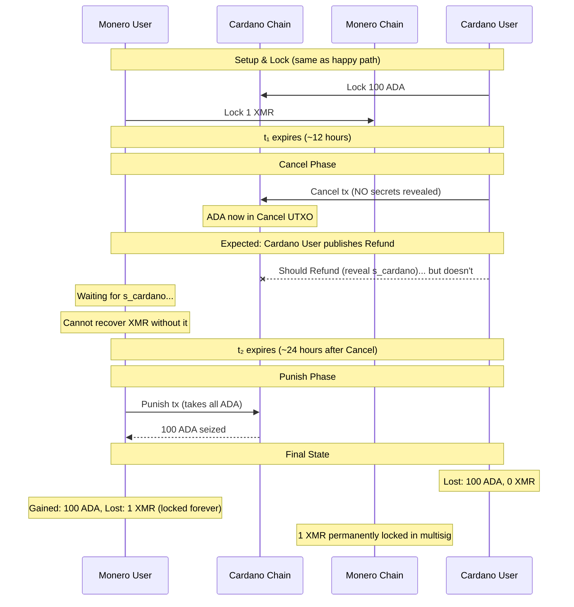

# Cardano User Cancels But Doesn't Refund: Punish Mechanism

> **Outcome**: Cardano User punished, loses entire swap amount to Monero User<br>
> **Key Learning**: Punish mechanism makes griefing economically irrational

## Story Summary

This is the most serious grief scenario. Both parties have locked their funds. Cardano User initiates a Cancel (perhaps legitimately waiting for Monero User, perhaps maliciously).

**Critical**: Cancel does NOT reveal any secrets. The ADA moves to a Cancel UTXO, but Monero User cannot yet recover their XMR.

Cardano User must then publish Refund to get their ADA back. The Refund transaction reveals `s_cardano` (Cardano User's Monero key share), which enables Monero User to recover their XMR.

If Cardano User doesn't Refund, Monero User can Punish after `t₂` — but their XMR remains locked forever. This is accepted as compensation (Monero User gets ADA instead).

---

## Parties and Motivation

### Cardano User (The Griefer)

- **Starting Balance**: 100 ADA, 0 XMR
- **Action**: Locks ADA, Cancels, but doesn't Refund
- **Motivation**: Attempt to grief (will fail and backfire)
- **Outcome**: **Loses 100 ADA** (punished)

### Monero User (The Victim, Compensated)

- **Starting Balance**: 0 ADA, 1 XMR
- **Situation**: Locked XMR, waiting for `s_cardano` to recover it
- **Protection**: Punish mechanism after t₂
- **Outcome**: **Gains 100 ADA** (but XMR locked forever)

---

## Protocol Parameters

| Parameter                  | Value                  | Role in This Scenario                  |
| -------------------------- | ---------------------- | -------------------------------------- |
| Swap Amount (Cardano User) | 100 ADA                | At risk, eventually lost to Punish     |
| Swap Amount (Monero User)  | 1 XMR                  | Locked forever (compensation: 100 ADA) |
| Timelock t₁                | ~12 hours              | When Cancel becomes available          |
| Timelock t₂                | ~24 hours after Cancel | When Punish becomes available          |

---

## Timeline Visualization

```
═══════════════════════════════════════════════════════════════════════════════
SETUP & LOCK PHASES (Same as Happy Path)
═══════════════════════════════════════════════════════════════════════════════

T=0:         🔒 Cardano User locks 100 ADA on Cardano
T+20 min:    🔒 Monero User locks 1 XMR on Monero

═══════════════════════════════════════════════════════════════════════════════
WAITING PHASE - MONERO USER DOESN'T BUY (or can't)
═══════════════════════════════════════════════════════════════════════════════

T+12 hours:  ⏰ Timelock t₁ expires

═══════════════════════════════════════════════════════════════════════════════
CANCEL PHASE - CARDANO USER INITIATES ABORT
═══════════════════════════════════════════════════════════════════════════════

T+12.5 hours: 🔄 Cardano User publishes Cancel transaction
              ├─ Moves ADA to Cancel UTXO
              ├─ NO secrets revealed
              └─ Commits to abort path (Buy no longer possible)

═══════════════════════════════════════════════════════════════════════════════
GRIEF PHASE - CARDANO USER DOESN'T REFUND
═══════════════════════════════════════════════════════════════════════════════

T+13-36 hours: ⏳ Cardano User is SUPPOSED to publish Refund...
               └─ But does NOTHING

               During this time:
               ├─ Monero User: Waiting for s_cardano (cannot recover XMR yet!)
               ├─ Cardano User: Has 100 ADA locked in Cancel UTXO
               └─ Cardano User hopes: Maybe they can outlast Monero User?

═══════════════════════════════════════════════════════════════════════════════
PUNISH PHASE - MONERO USER TAKES COMPENSATION
═══════════════════════════════════════════════════════════════════════════════

T+36 hours:   ⏰ Timelock t₂ expires - Punish window opens

T+36.5 hours: ⚡ Monero User publishes Punish transaction
              ├─ Takes ALL 100 ADA from Cancel UTXO
              ├─ Cardano User loses ADA
              └─ XMR remains locked forever (neither party can spend)

═══════════════════════════════════════════════════════════════════════════════
PUNISHMENT COMPLETE
═══════════════════════════════════════════════════════════════════════════════

Final State:
├─ Cardano User: 0 ADA, 0 XMR (LOST 100 ADA)
└─ Monero User: 100 ADA, 0 XMR (GAINED 100 ADA, LOST 1 XMR to lockup)

Net: Monero User compensated with ADA for locked XMR
```

---

## Narrative Flow

### Act I: The Setup

Everything proceeds normally through setup and locking:

1. Both parties complete setup (keys, pre-signatures)
2. Cardano User locks 100 ADA on Cardano
3. Monero User verifies and locks 1 XMR on Monero

At this point, funds are locked on both chains.

### Act II: The Cancel

For whatever reason, Monero User doesn't Buy their ADA within the happy path timeframe. After t₁, Cardano User publishes Cancel:

```
Cancel Transaction:
├─ Input: Lock UTXO (100 ADA)
├─ Output: Cancel UTXO (100 ADA)
├─ Witness: Cardano User's signature (standard, NO adaptor)
└─ Effect: Commits to abort, eliminates Buy path
```

**Critical**: Cancel reveals NO secrets. Monero User cannot yet recover XMR.

### Act III: The Expected Refund (That Doesn't Happen)

Cardano User is **supposed** to:

1. Publish the Refund transaction
2. Refund reveals `s_cardano` via adaptor signature
3. Monero User extracts `s_cardano`, recovers XMR
4. Cardano User gets their ADA back

But Cardano User thinks: "What if I just... don't Refund? The XMR is locked, my ADA is locked... stalemate?"

**Cardano User does nothing.**

### Act IV: The Punishment

Cardano User's gambit fails. After timelock t₂ expires:

```
Punish Transaction:
├─ Input: Cancel UTXO (100 ADA)
├─ Output: Monero User's address (100 ADA)
├─ Timelock: Must be after t₂
└─ Signer: Monero User (using pre-signed authorization from setup)
```

**Monero User takes the ADA as compensation.**

### Act V: The Permanent XMR Lockup

Because Cardano User never revealed `s_cardano`:

- Monero User only knows `s_monero`
- The 2-of-2 multisig requires `s_total = s_cardano + s_monero`
- **Neither party can spend the XMR — it's locked forever**

This is the "punishment cost" — Monero User loses their XMR but is compensated with ADA.

---

## Sequence Diagram



---

## Balance Sheet

| Party               | Before         | After              | Net Change           |
| ------------------- | -------------- | ------------------ | -------------------- |
| **Cardano User**    | 100 ADA, 0 XMR | **0 ADA, 0 XMR**   | **-100 ADA**         |
| **Monero User**     | 0 ADA, 1 XMR   | **100 ADA, 0 XMR** | **+100 ADA, -1 XMR** |
| **Monero Multisig** | 0 XMR          | **1 XMR (locked)** | Permanent loss       |

**Note**: Monero User is compensated for their locked XMR with ADA of equivalent value.

---

## Key Insights

### 1. Griefing is Economically Irrational

Let's analyze Cardano User's options after Cancel:

| Action               | Cardano User Gets    | Monero User Gets                   |
| -------------------- | -------------------- | ---------------------------------- |
| Refund (honest)      | 100 ADA back         | Extracts s_cardano, recovers 1 XMR |
| Don't Refund (grief) | **0 ADA** (punished) | **100 ADA** (XMR locked)           |

**Rational choice**: Always Refund.

Griefing results in:

- Cardano User loses **100 ADA** (vs. getting 100 ADA back)
- Net loss of **100 ADA** compared to honest behavior

### 2. Why Would Cardano User Ever Grief?

There's no rational reason. Possible explanations:

- **Malice**: Wants to hurt Monero User (but hurts themselves more)
- **Technical failure**: Lost keys, software crash (see [05-technical-failure.md](05-technical-failure.md))
- **Mistake**: Misunderstood the protocol

In all cases, Monero User is protected by compensation.

### 3. The XMR Lockup is Acceptable

Why is locking XMR forever acceptable for Monero User?

1. **Compensation**: They receive ADA of equivalent value
2. **Economic equivalence**: Swap was for ADA anyway
3. **Alternative worse**: Without Punish, griefing Cardano User faces no penalty

### 4. No "Free Option" Attack

Because Cancel reveals nothing, Monero User cannot recover XMR until Cardano User Refunds:

```
Cancel → NO secrets → Monero User CANNOT recover XMR yet
Refund → s_cardano revealed → Monero User recovers XMR
                            → ADA returned to Cardano User
                            → No Punish possible (Cancel UTXO spent)

OR

Cancel → NO secrets → Cardano User doesn't Refund
Punish → Monero User gets ADA → s_cardano never revealed
                              → XMR locked forever
```

**Monero User cannot get both XMR and ADA** — this is the key security property.

---

## Technical Notes

<details>
<summary>Cancel UTXO Script Logic</summary>

### Cancel UTXO Script

The Cancel UTXO script has two spending paths:

```haskell
validateCancelUtxo :: Datum -> Redeemer -> ScriptContext -> Bool
validateCancelUtxo datum redeemer ctx = case redeemer of
    -- Path 1: Refund (anytime, reveals s_cardano)
    -- Cardano User gets ADA back by revealing their Monero key share
    Refund ->
        -- Verify adaptor signature that reveals s_cardano
        verifyAdaptorSignature ctx (cardanoUserPk datum) (refundAdaptorSig datum)

    -- Path 2: Punish (after t₂)
    -- Monero User takes ADA as compensation
    Punish ->
        currentSlot ctx > punishTimelock datum
        &&
        txSignedBy ctx (moneroUserPkh datum)
```

### Pre-signatures Created During Setup

```
1. σ̃_refund: Adaptor signature on Refund tx, encrypted with S_cardano
   - Created by: Monero User
   - Given to: Cardano User
   - Decryption reveals: s_cardano

2. σ_punish: Standard signature on Punish tx
   - Created by: Cardano User (during setup)
   - Given to: Monero User
   - Can be used after t₂
```

</details>

---

## The Race After t₂

After t₂ expires, both Refund and Punish become possible:

```
After t₂:
├─ Cardano User can: Refund (reveal s_cardano, get 100 ADA)
└─ Monero User can: Punish (take 100 ADA, XMR locked forever)

First valid transaction wins!
```

**In practice**:

- If Cardano User wanted to Refund, they would have done so before t₂
- Monero User will be monitoring and submit Punish immediately after t₂
- The race is mostly theoretical — honest Cardano Users Refund early

### Race Condition Details

**Transaction Ordering:**

- Both Refund and Punish spend the same UTXO (Cancel UTXO)
- Only one can succeed (mutual exclusion by UTXO model)
- Block producer chooses which to include if both in mempool

**Asymmetry:**

- Cardano User can dynamically adjust Refund fee
- Monero User's Punish uses pre-signed transaction (fixed fee)
- This favors Cardano User in fee-competitive scenarios

**Mitigation for Monero User:**

- Monitor closely starting at t₂ - δ (e.g., 10 minutes before)
- Submit Punish to mempool just before t₂ expires
- Use fee estimation to ensure competitive inclusion

---

## Why Can't Cardano User Steal Both?

Let's trace an attempted theft:

1. ✅ Cardano User Cancels (NO secrets revealed)
2. ⏳ Cardano User waits... hoping for... something?
3. ❌ Monero User cannot recover XMR (no `s_cardano`)
4. ⏰ t₂ expires
5. ⚡ Monero User Punishes
6. 💀 Cardano User loses ADA
7. 🔒 XMR locked forever (Cardano User can't spend it either!)

**There's no path where Cardano User gets both ADA and XMR.**

---

## Comparison: Honest vs. Grief Outcomes

### If Cardano User is Honest After Cancel

```
Cardano User: Refunds → Gets 100 ADA, reveals s_cardano
Monero User: Extracts s_cardano → Recovers 1 XMR
Result: Both parties refunded, no harm done
```

### If Cardano User Griefs After Cancel

```
Cardano User: Doesn't Refund → Loses 100 ADA
Monero User: Punishes → Gets 100 ADA, loses 1 XMR (locked)
Result: Griefer punished, victim compensated
```

**The math is clear**: Griefing costs 100 ADA + gains nothing. Honesty costs 0.

---

## Next: What about legitimate technical failures?

Continue to [05-technical-failure.md](05-technical-failure.md) to see how the protocol handles network issues and software crashes.
