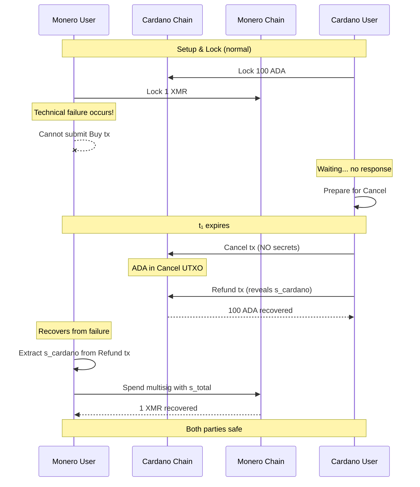

# Technical Failure: Safe Recovery via Cancel + Refund

---

**Outcome**: Both parties refunded, no swap occurs
**Key Learning**: Protocol prioritizes safety; failures are indistinguishable from grief

---

## Story Summary

Both parties have locked their funds and everything is proceeding normally. But something goes wrong — network issues, software crash, lost keys, or simply life getting in the way. The Cancel + Refund mechanism provides a safe recovery path for both parties.

---

## Types of Technical Failures

| Failure Type           | Affects      | Recovery                      |
| ---------------------- | ------------ | ----------------------------- |
| Network outage         | Either party | Wait, then Cancel + Refund    |
| Software crash         | Either party | Restart, then Cancel + Refund |
| Lost access to keys    | Either party | Cancel + Refund (if possible) |
| Wallet synchronization | Either party | Wait, then Cancel + Refund    |
| User unavailability    | Either party | Cancel + Refund on return     |

---

## Parties and Situation

### Monero User (Affected by Failure)

- **Starting Balance**: 0 ADA, 1 XMR (locked in multisig)
- **Situation**: Unable to Buy ADA due to technical issues
- **Goal**: Recover locked XMR
- **Protection**: Key extraction from Refund tx

### Cardano User (Waiting)

- **Starting Balance**: 100 ADA (locked), 0 XMR
- **Situation**: Waiting for Monero User, but they're unresponsive
- **Goal**: Recover locked ADA
- **Protection**: Cancel + Refund mechanism after t₁

---

## Timeline Visualization

```
═══════════════════════════════════════════════════════════════════════════════
SETUP & LOCK PHASES (Normal)
═══════════════════════════════════════════════════════════════════════════════

T=0:         🔒 Cardano User locks 100 ADA on Cardano
T+20 min:    🔒 Monero User locks 1 XMR on Monero
             └─ Both parties expect happy path...

═══════════════════════════════════════════════════════════════════════════════
TECHNICAL FAILURE OCCURS
═══════════════════════════════════════════════════════════════════════════════

T+1 hour:    💥 Technical failure hits Monero User
             ├─ Possible: Network outage
             ├─ Possible: Software crash
             ├─ Possible: Hardware failure
             └─ Possible: Emergency IRL situation

T+2 hours:   ⏳ Cardano User waiting...
             └─ No sign of Buy transaction

T+6 hours:   ⏳ Still waiting...
             └─ Growing concern

T+11 hours:  ⏳ Approaching Cancel window
             └─ Cardano User prepares Cancel

═══════════════════════════════════════════════════════════════════════════════
CANCEL AND RECOVERY
═══════════════════════════════════════════════════════════════════════════════

T+12 hours:  ⏰ Timelock t₁ expires

T+12.5 hours: 🔄 Cardano User publishes Cancel
              ├─ Moves ADA to Cancel UTXO
              └─ NO secrets revealed yet

T+13 hours:  🔓 Cardano User publishes Refund
             ├─ Reveals s_cardano via adaptor signature
             └─ Recovers 100 ADA

T+13.5 hours: 🔍 Monero User (back online) sees Refund
              ├─ Extracts s_cardano from Refund tx
              └─ Computes s_total = s_cardano + s_monero

T+14 hours:  🔓 Monero User recovers XMR from multisig
             └─ Spends 2-of-2 with complete key

═══════════════════════════════════════════════════════════════════════════════
BOTH PARTIES RECOVERED
═══════════════════════════════════════════════════════════════════════════════

Final State:
├─ Cardano User: 100 ADA, 0 XMR (original balance restored)
└─ Monero User: 0 ADA, 1 XMR (original balance restored)
```

---

## Narrative Flow

### Act I: The Failure

Monero User has locked their XMR and is ready to Buy ADA. But then:

**Scenario A: Network Outage**

```
Monero User's ISP has a major outage
├─ Cannot access Cardano node
├─ Cannot submit Buy transaction
└─ Cannot communicate with Cardano User
```

**Scenario B: Software Crash**

```
Monero User's wallet software crashes
├─ Corrupted state
├─ Need to resync
└─ Hours of recovery time
```

**Scenario C: Life Happens**

```
Monero User has emergency
├─ Medical situation
├─ Family crisis
├─ Cannot attend to swap
└─ May be unavailable for days
```

### Act II: Cardano User's Dilemma

From Cardano User's perspective:

- Monero User is unresponsive
- No Buy transaction appears
- No way to know if grief or genuine failure
- Funds are locked

**The protocol doesn't try to distinguish** — it provides the same safe recovery path for both cases.

### Act III: Cancel and Refund Recovery

After t₁ expires, Cardano User initiates Cancel:

1. Publishes Cancel transaction (NO secrets revealed)
2. ADA moves to Cancel UTXO
3. Buy path is eliminated

Then Cardano User publishes Refund:

1. Publishes Refund transaction
2. Refund uses adaptor signature revealing `s_cardano`
3. ADA returned to Cardano User

When Monero User recovers (comes back online, fixes software, etc.):

1. Sees Refund transaction on Cardano
2. Extracts `s_cardano` from the adaptor signature
3. Computes `s_total = s_cardano + s_monero`
4. Recovers XMR from Monero multisig

---

## Sequence Diagram



---

## Balance Sheet

| Party            | Before         | After          | Net Change      |
| ---------------- | -------------- | -------------- | --------------- |
| **Cardano User** | 100 ADA, 0 XMR | 100 ADA, 0 XMR | ±0 (minus fees) |
| **Monero User**  | 0 ADA, 1 XMR   | 0 ADA, 1 XMR   | ±0 (minus fees) |

---

## Key Insights

### 1. Indistinguishable from Grief

Technical failure and intentional grief are **identical** from the protocol's perspective:

| Scenario          | Monero User Buys? | Resolution      |
| ----------------- | ----------------- | --------------- |
| Technical failure | No (can't)        | Cancel + Refund |
| Intentional grief | No (won't)        | Cancel + Refund |

**Design philosophy**: Rather than trying to punish the right party, ensure both can safely recover.

### 2. Safety Over Punishment

The protocol prioritizes:

1. **Safety**: Both parties can always recover funds
2. **Liveness**: Protocol terminates within bounded time
3. **Fairness**: No party gains from the failure

Only **provable** griefing (Cancel without Refund) is punished. Ambiguous situations default to safe refund.

### 3. The Timelock Trade-off

| Shorter t₁                    | Longer t₁                  |
| ----------------------------- | -------------------------- |
| Faster recovery from failures | More time to complete swap |
| Less waiting for Cardano User | Better for slow networks   |
| More aggressive timeouts      | More tolerance for delays  |

Typical value (~12 hours) balances recovery speed with operational flexibility.

### 4. Monero User Can Recover Even If Offline During Refund

The Refund mechanism doesn't require Monero User to be online:

```
1. Refund published → s_cardano is ON-CHAIN
2. Monero User comes back online (hours, days later)
3. Reads Refund tx from historical data
4. Extracts s_cardano
5. Recovers XMR
```

**Important**: Monero User should recover XMR promptly once back online, as their key share `s_cardano` is now public. While only Monero User knows `s_monero`, the revealed key share is still sensitive information.

---

## What If Both Parties Have Technical Issues?

| Cardano User | Monero User | Outcome                                              |
| ------------ | ----------- | ---------------------------------------------------- |
| Online       | Offline     | Cancel + Refund, Monero User recovers XMR later      |
| Offline      | Online      | Monero User waits, then Cardano User Cancel + Refund |
| Offline      | Offline     | Both recover when back, via Cancel + Refund          |

The protocol is robust to all combinations because:

- Cancel only requires Cardano User
- Refund only requires Cardano User
- Key extraction only requires reading blockchain
- Monero recovery only requires Monero User (with extracted key)

---

## Technical Notes

<details>
<summary>Failure Recovery Best Practices</summary>

### For Monero User (XMR at Risk)

```
Priority 1: Monitor for Refund transaction
├─ Even if you can't complete swap
├─ Check Cardano blockchain for Refund
└─ Extract s_cardano ASAP if Refund appears

Priority 2: Recover XMR immediately
├─ Once you have s_cardano
├─ Compute s_total = s_cardano + s_monero
└─ Spend the 2-of-2 multisig

Priority 3: Set up monitoring
├─ External service to watch for Refund
├─ Alert system for critical events
└─ Backup access methods
```

### For Cardano User (ADA at Risk)

```
Priority 1: Wait for t₁
├─ Don't panic before timelock
├─ Monero User may be delayed
└─ Cancel costs fees

Priority 2: Cancel + Refund promptly after t₁
├─ If no Buy appears
├─ Publish Cancel first
├─ Then publish Refund immediately
└─ Complete both before t₂

Priority 3: Don't Cancel without Refunding!
├─ If you Cancel but don't Refund
├─ You will get Punished after t₂
└─ Always complete the full Cancel + Refund sequence
```

</details>

<details>
<summary>Key Management Checklist</summary>

### Before Starting Any Swap

- [ ] **Backup all key material** in secure offline storage
- [ ] **s_cardano / s_monero**: Private key shares (CRITICAL - loss means fund loss)
- [ ] **Adapter secret y**: Required for swap completion (Monero User only)
- [ ] **Pre-signatures**: σ̃_buy, σ̃_refund (one-time use, cannot regenerate)

### Key Storage Requirements

| Key Material       | Storage                   | Recovery If Lost                 |
| ------------------ | ------------------------- | -------------------------------- |
| Private key shares | Encrypted backup, offline | Cancel + Refund (if possible)    |
| Adapter secret     | Memory + encrypted backup | Cannot recover (must abort)      |
| Pre-signatures     | Session file, encrypted   | Cannot regenerate (must restart) |

### Critical: Pre-signature Uniqueness

Pre-signatures are created during setup and **cannot be regenerated**:

- Each pre-signature is bound to specific transaction parameters
- Losing pre-signatures means losing ability to complete that transaction
- Always backup pre-signatures before proceeding to lock phase

### Emergency Recovery

If keys are lost DURING an active swap:

1. **Before Lock**: Safe to abort, no funds at risk
2. **After Lock, before Cancel**: Wait for t₁, then Cancel + Refund (if you have Refund pre-sig)
3. **After Cancel, before Refund**: DANGER - may get Punished if can't Refund
4. **Lost s_monero after Refund**: XMR stuck forever (need both shares)

</details>

---

## Comparison: All Cancel Scenarios

| Scenario          | Cause            | Who Initiates Cancel | Outcome     |
| ----------------- | ---------------- | -------------------- | ----------- |
| Technical failure | Unintentional    | Cardano User         | Both refund |
| Monero User grief | Intentional      | Cardano User         | Both refund |
| Market changed    | Mutual agreement | Cardano User         | Both refund |

All three scenarios follow the same Cancel + Refund path. The protocol doesn't distinguish because:

- It can't read minds
- Punishment for ambiguous cases would be unfair
- Safe recovery is more important than punishment

---

## What About Cardano User Technical Failure?

If Cardano User has issues after Cancel:

| Phase                       | Cardano User Status | What Happens                   |
| --------------------------- | ------------------- | ------------------------------ |
| Before Cancel               | Offline             | Nothing (can't Cancel yet)     |
| During Cancel               | Offline             | Can't Cancel until back online |
| After Cancel, before Refund | Offline             | **DANGER: May get Punished!**  |

**Critical**: If Cardano User publishes Cancel and then goes offline:

1. Monero User waits for Refund...
2. No Refund appears (Cardano User offline)
3. t₂ expires
4. Monero User Punishes
5. Cardano User loses ADA!
6. XMR locked forever (s_cardano never revealed)

**Lesson**: Don't publish Cancel unless you can complete Refund immediately after.

---

## Summary

Technical failure is handled the same as grief because:

1. Protocol can't distinguish intent
2. Safe recovery is the priority
3. Only clear griefing (Cancel without Refund) is punished

Both parties can always recover their funds through the Cancel + Refund mechanism, regardless of what caused the failure.

---

## Return to [PROTOCOL](../PROTOCOL.md) for the complete scenario overview.
