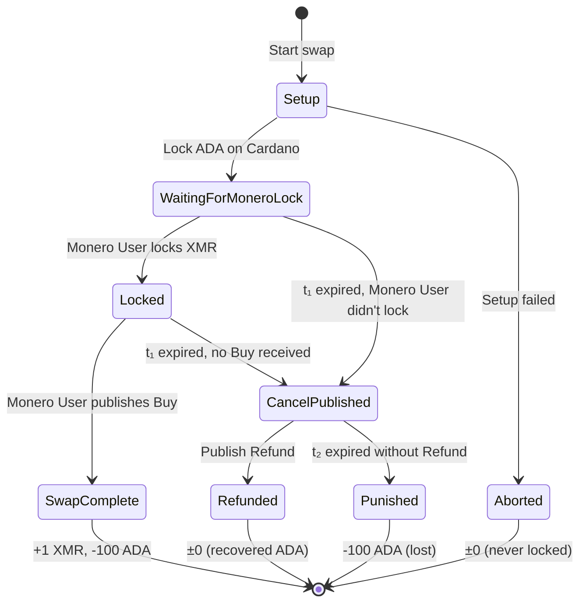
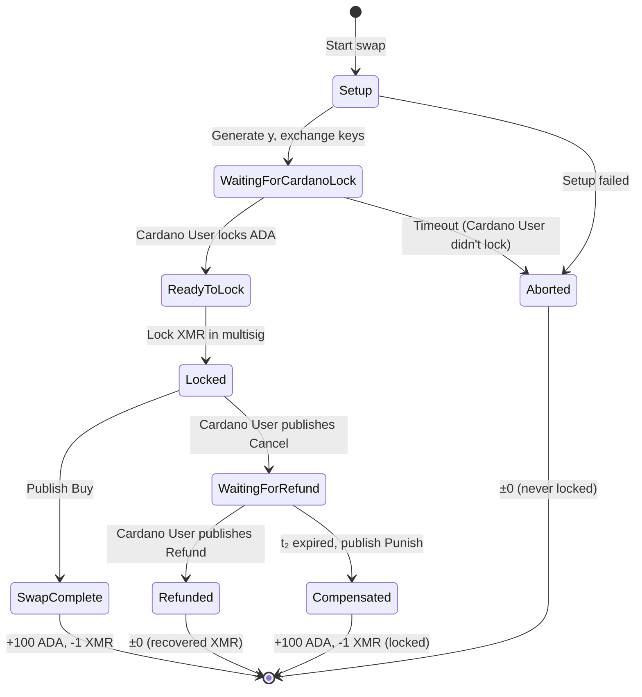
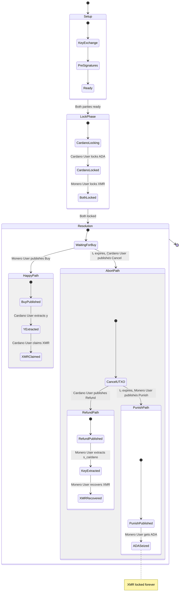
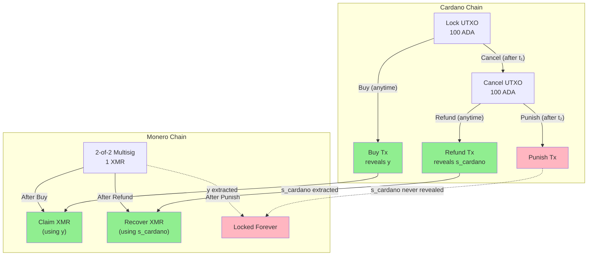
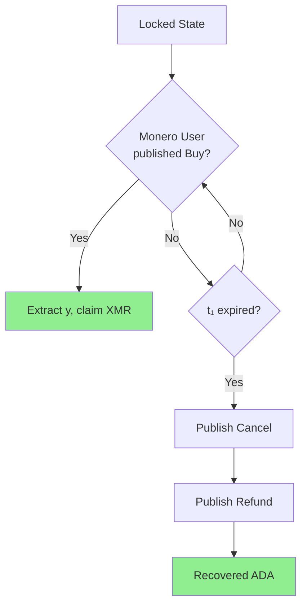
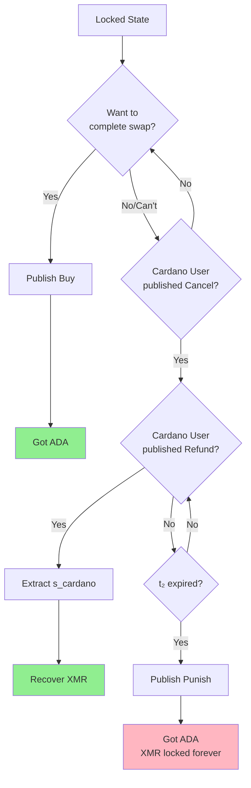

# Protocol State Machines

This document provides state machine diagrams for both parties in the atomic swap protocol.

---

## Cardano User State Machine



**Monero User Grief Paths**:

- Never locks XMR: WaitingForMoneroLock → CancelPublished → Refunded
- Locks but doesn't Buy: Locked → CancelPublished → Refunded

### Cardano User State Descriptions

| State                    | Description                        | Actions Available                   |
| ------------------------ | ---------------------------------- | ----------------------------------- |
| **Setup**                | Exchanging keys and pre-signatures | Lock ADA, or abort                  |
| **WaitingForMoneroLock** | ADA locked, waiting for XMR        | Wait, or Cancel after t₁            |
| **Locked**               | Both parties have locked funds     | Wait for Buy, or Cancel after t₁    |
| **CancelPublished**      | Committed to abort path            | Refund (before t₂), or get Punished |
| **SwapComplete**         | Successfully swapped               | Extract y, claim XMR                |
| **Refunded**             | Recovered ADA via Refund           | Done                                |
| **Punished**             | Lost ADA to Punish                 | Done                                |
| **Aborted**              | Swap never started                 | Done                                |

---

## Monero User State Machine



### Monero User State Descriptions

| State                     | Description                            | Actions Available                   |
| ------------------------- | -------------------------------------- | ----------------------------------- |
| **Setup**                 | Generating y, exchanging keys          | Continue setup, or abort            |
| **WaitingForCardanoLock** | Ready to lock, waiting for ADA         | Wait, or abort if timeout           |
| **ReadyToLock**           | Cardano lock verified                  | Lock XMR                            |
| **Locked**                | Both parties have locked funds         | Buy (claim ADA), or wait            |
| **WaitingForRefund**      | Cancel published, waiting for Refund   | Wait for Refund, or Punish after t₂ |
| **SwapComplete**          | Successfully swapped                   | Done                                |
| **Refunded**              | Recovered XMR via key extraction       | Done                                |
| **Compensated**           | Got ADA via Punish, XMR locked forever | Done                                |
| **Aborted**               | Swap never started                     | Done                                |

---

## Combined Protocol State Machine



---

## Transaction Flow Diagram



---

## State Transitions by Transaction

| Transaction        | From State      | To State             | Triggers                      | Reveals     |
| ------------------ | --------------- | -------------------- | ----------------------------- | ----------- |
| **Lock (Cardano)** | Setup           | WaitingForMoneroLock | Cardano User                  | —           |
| **Lock (Monero)**  | ReadyToLock     | Locked               | Monero User                   | —           |
| **Buy**            | Locked          | SwapComplete         | Monero User                   | `y`         |
| **Cancel**         | Locked          | CancelPublished      | Cardano User (after t₁)       | —           |
| **Refund**         | CancelPublished | Refunded             | Cardano User                  | `s_cardano` |
| **Punish**         | CancelPublished | Punished/Compensated | Monero User (after t₂)        | —           |
| **Claim XMR**      | SwapComplete    | Done                 | Cardano User (has `y`)        | —           |
| **Recover XMR**    | Refunded        | Done                 | Monero User (has `s_cardano`) | —           |

---

## Timeline with States

```
Time    Cardano User State          Monero User State           Possible Txs
─────────────────────────────────────────────────────────────────────────────
T=0     Setup                       Setup                       —
        │                           │
        ▼                           ▼
T+0     WaitingForMoneroLock        WaitingForCardanoLock       Lock (Cardano)
        │                           │
        │                           ▼
T+20m   WaitingForMoneroLock        ReadyToLock                 —
        │                           │
        ▼                           ▼
T+30m   Locked                      Locked                      Lock (Monero)
        │                           │
        │                           │
═══════════════════════════════════════════════════════════════════════════════
        HAPPY PATH
═══════════════════════════════════════════════════════════════════════════════
        │                           │
        │                           ▼
T+1h    Locked                      SwapComplete                Buy
        │                           │
        ▼                           │
T+2h    SwapComplete                SwapComplete                Claim XMR
        │                           │
        ▼                           ▼
        [+1 XMR, -100 ADA]          [+100 ADA, -1 XMR]

═══════════════════════════════════════════════════════════════════════════════
        ABORT PATH (if no Buy)
═══════════════════════════════════════════════════════════════════════════════
        │                           │
T+12h   t₁ expires                  t₁ expires                  —
        │                           │
        ▼                           ▼
T+12.5h CancelPublished             WaitingForRefund            Cancel
        │                           │
        ▼                           │
T+13h   Refunded                    WaitingForRefund            Refund
        │                           │
        │                           ▼
T+14h   Refunded                    Refunded                    Recover XMR
        │                           │
        ▼                           ▼
        [±0, recovered ADA]         [±0, recovered XMR]

═══════════════════════════════════════════════════════════════════════════════
        PUNISH PATH (if no Refund after Cancel)
═══════════════════════════════════════════════════════════════════════════════
        │                           │
T+12.5h CancelPublished             WaitingForRefund            Cancel
        │                           │
        │ (Cardano User offline)    │
        │                           │
T+36h   t₂ expires                  t₂ expires                  —
        │                           │
        ▼                           ▼
T+36.5h Punished                    Compensated                 Punish
        │                           │
        ▼                           ▼
        [-100 ADA, lost]            [+100 ADA, -1 XMR locked]
```

---

## Decision Points

### Cardano User Decisions



### Monero User Decisions



---

## State Invariants

### Safety Properties

1. **No double-spend**: Each UTXO can only be spent once
   - Lock UTXO → Buy OR Cancel (not both)
   - Cancel UTXO → Refund OR Punish (not both)

2. **Atomicity**: If one party claims, the other can always claim
   - Buy reveals `y` → Cardano User can claim XMR
   - Refund reveals `s_cardano` → Monero User can recover XMR

3. **No free option**: Monero User cannot get both XMR and ADA
   - XMR recovery requires `s_cardano` from Refund tx
   - Punish means `s_cardano` never revealed → XMR locked forever

### Liveness Properties

1. **Bounded termination**: Protocol always terminates within t₁ + t₂ + confirmations
2. **Recovery possible**: Both parties can always recover funds (via abort path)
3. **No deadlock**: Every state has at least one valid transition
